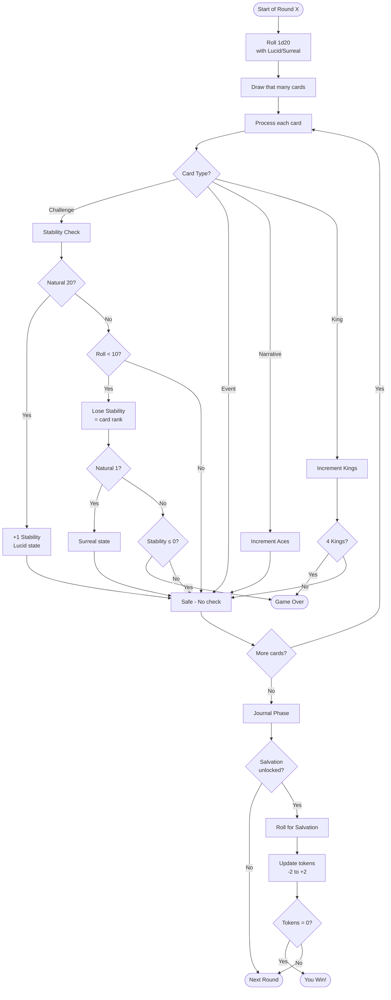

# D20 Solo RPG System - Mechanics Guide

## Digital Implementation Reference

**Version:** 3.0 (D20 System)
**Date:** 2025-11-17
**Purpose:** Complete D20 mechanics specification for implementation and testing
**System:** D20-based tactical solo journaling RPG inspired by Wretched and Alone

---

## Table of Contents

1. [System Overview](#1-system-overview)
2. [Core Resources](#2-core-resources)
3. [D20 Rolling Mechanics](#3-d20-rolling-mechanics)
4. [Salvation System (Win Condition)](#4-salvation-system-win-condition)
5. [Card Types](#5-card-types)
6. [Game Flow](#6-game-flow)
7. [Win & Loss Conditions](#7-win--loss-conditions)
8. [Balance & Probabilities](#8-balance--probabilities)
9. [Implementation Details](#9-implementation-details)

---

## 1. System Overview

### 1.1 Core Philosophy

The D20 Solo RPG System is a **tactical solo journaling RPG** that combines:

- **Strategic Depth**: Lucid/Surreal states create meaningful tactical choices
- **Progressive Difficulty**: Graduated token changes reward skill and punish mistakes
- **Narrative Emergence**: Story emerges through card prompts and journaling
- **Fair Challenge**: ~15-20% win rate with optimal play
- **Dual-Phase Structure**: Action phase + reflection phase

### 1.2 Key Differences from d6 System

**D20 System Changes:**

- Uses d20 (1-20) instead of d6 (1-6) for all rolls
- Stability checks instead of tower pulls
- Graduated token changes (-2 to +2) instead of binary success/failure
- Lucid (advantage) and Surreal (disadvantage) states
- Ace-dependent Salvation thresholds
- No final damage roll (victory when tokens = 0)

### 1.3 Play Time

- **Typical Game:** 30-45 minutes
- **Short Game:** 15-25 minutes (lucky Ace draws)
- **Long Game:** 60-90 minutes (unlucky Salvation rolls)

---

## 2. Core Resources

### 2.1 Stability (Your Life)

```
STABILITY: 20 → 0

States:
- 20-15: Stable (green)
- 14-10: Strained (yellow)
- 9-5:  Critical (orange)
- 4-1:  Desperate (red)
- 0:    FAILURE (game over)
```

**Properties:**

- Starting value: 20
- Lost through failed Stability checks (Challenge cards)
- Can be gained: Natural 20 on Stability check grants +1 (max 20)
- Reaches 0 → Instant loss

### 2.2 Tokens (Path to Victory)

```
TOKENS: 10 → 0

Goal: Remove all tokens to win
Unlocked by: Drawing Ace of Hearts (Salvation)
```

**Properties:**

- Starting value: 10 (when Salvation unlocked)
- Changed through Salvation checks (d20 rolls)
- Graduated changes based on roll:
  - Natural 1: +2 tokens (critical failure)
  - Below threshold: +1 token (failure)
  - At/above threshold: -1 token (success)
  - Natural 20: -2 tokens (critical success)
- Reaches 0 with Stability > 0 → Victory

### 2.3 Aces Revealed (Abilities)

```
ACES: 0 → 4

Each Ace improves Salvation success rate
```

**Properties:**

- Starting value: 0 (1 in easy mode)
- Incremented when Narrative cards (Aces) are drawn
- Determines Salvation threshold:
  - 1 Ace: Threshold 17 (20% success rate)
  - 2 Aces: Threshold 14 (35% success rate)
  - 3 Aces: Threshold 11 (50% success rate)
  - 4 Aces: Threshold 0 (100% success rate - auto-win)

---

## 3. D20 Rolling Mechanics

### 3.1 Standard Roll

```javascript
// Roll 1d20 (1-20)
const roll = rollDie(20);
```

**Used for:**

- Round start (determines cards to draw)
- Stability checks (Challenge cards)
- Salvation checks (token removal attempts)

### 3.2 Lucid State (Advantage)

```
LUCID = Advantage
Roll 2d20, keep highest

Trigger: Natural 20 on any Stability check
Duration: Next roll only (consumed on use)
```

**Example:**

```javascript
// Lucid state: Roll 2d20, keep higher
const roll1 = 8;
const roll2 = 15;
const result = Math.max(roll1, roll2); // 15
```

**Strategic Value:**

- Significantly improves next check success rate
- Can turn a likely failure into a likely success
- Creates tactical decision: "When should I attempt Salvation?"

### 3.3 Surreal State (Disadvantage)

```
SURREAL = Disadvantage
Roll 2d20, keep lowest

Trigger: Natural 1 on any Stability check
Duration: Next roll only (consumed on use)
```

**Example:**

```javascript
// Surreal state: Roll 2d20, keep lower
const roll1 = 8;
const roll2 = 15;
const result = Math.min(roll1, roll2); // 8
```

**Strategic Risk:**

- Significantly worsens next check success rate
- Can turn a likely success into a likely failure
- Creates tension: "Can I survive until this clears?"

### 3.4 State Priority

**Important:** Only ONE state can be active at a time.

```javascript
// State resolution order
if (isLucid) {
	// Roll with advantage, clear Lucid
	isLucid = false;
	isSurreal = false;
} else if (isSurreal) {
	// Roll with disadvantage, clear Surreal
	isSurreal = false;
	isLucid = false;
}
```

**Edge Cases:**

- If Lucid and you roll natural 1 → Lose Lucid, gain Surreal
- If Surreal and you roll natural 20 → Lose Surreal, gain Lucid
- States do NOT stack (can't have Lucid + Surreal)

---

## 4. Salvation System (Win Condition)

### 4.1 Unlocking Salvation

**Trigger:** Draw Ace of Hearts (Primary Success card)

**Effects:**

```
1. Set aceOfHeartsRevealed = true
2. Set tokens = 10
3. Enable Salvation checks at end of each round
4. Increment acesRevealed (affects threshold)
```

### 4.2 Salvation Thresholds

```
Aces | Threshold | Success on | Win Rate | Probability
-----|-----------|------------|----------|------------
  1  |    17     | 17-20      |   20%    | Very Hard
  2  |    14     | 14-20      |   35%    | Hard
  3  |    11     | 11-20      |   50%    | Medium
  4  |     0     | Any roll   |  100%    | Auto-win
```

**Calculation:**

```javascript
function getSalvationThreshold(acesRevealed) {
	const thresholds = [20, 17, 14, 11, 0];
	return thresholds[Math.min(acesRevealed, 4)];
}
```

### 4.3 Salvation Check Resolution

```javascript
function resolveSalvationCheck(roll, threshold) {
	// Natural 1: Critical failure
	if (roll === 1) {
		return { change: +2, type: 'critical_failure' };
	}

	// Natural 20: Critical success
	if (roll === 20) {
		return { change: -2, type: 'critical_success' };
	}

	// Normal success
	if (roll >= threshold) {
		return { change: -1, type: 'success' };
	}

	// Normal failure
	return { change: +1, type: 'failure' };
}
```

**Graduated Token Changes:**

| Roll       | Result           | Token Change | Example (10 → ?) |
| ---------- | ---------------- | ------------ | ---------------- |
| Natural 1  | Critical Failure | +2           | 10 → 12          |
| < Thresh   | Failure          | +1           | 10 → 11          |
| ≥ Thresh   | Success          | -1           | 10 → 9           |
| Natural 20 | Critical Success | -2           | 10 → 8           |

**Strategic Depth:**

- Natural 1s can make the game unwinnable (tokens keep increasing)
- Natural 20s provide crucial acceleration
- Creates meaningful tension in every Salvation roll

---

## 5. Card Types

### 5.1 Card Type Distribution

```
Total Cards: 52

Type              | Ranks          | Count | Percentage
------------------|----------------|-------|------------
Primary Success   | A♥            | 1     | 2%
Narrative         | A♦, A♣, A♠    | 3     | 6%
Failure Counter   | K♥, K♦, K♣, K♠| 4     | 8%
Challenge         | 3,5,7,9 (all) | 16    | 31%
Event             | 2,4,6,8,10,J,Q| 28    | 53%
```

### 5.2 Primary Success (Ace of Hearts)

**Card:** A♥

**Effects:**

1. Unlock Salvation checks
2. Set tokens to 10
3. Increment acesRevealed to 1
4. No Stability check (it's a Narrative card)

**Narrative Role:** The moment hope emerges. The path to escape becomes visible.

### 5.3 Narrative Cards (Abilities)

**Cards:** A♦, A♣, A♠

**Effects:**

1. Increment acesRevealed
2. Improve Salvation threshold
3. No Stability check
4. Optional modifiers: skip-damage, return-king

**Narrative Role:** Moments of respite, reflection, and empowerment.

**Ace Progression:**

```
1st Ace (A♥): Hope emerges → Salvation unlocked (17 threshold)
2nd Ace:      Growing strength → Threshold improves to 14
3rd Ace:      Mastery → Threshold improves to 11
4th Ace:      Transcendence → Auto-win Salvation checks
```

### 5.4 Failure Counter (Kings)

**Cards:** K♥, K♦, K♣, K♠

**Effects:**

1. Increment kingsRevealed
2. Mark specific king as revealed (e.g., kingOfHearts = true)
3. No Stability check (even rank)
4. Display king permanently

**Instant Loss:** Revealing all 4 Kings → Game Over

**Narrative Role:** Escalating existential threat. Doom approaches.

### 5.5 Challenge Cards

**Cards:** 3, 5, 7, 9 (all suits) - 16 total

**Effects:**

1. Trigger Stability check (roll d20)
2. Compare roll to 10 (default DC)
3. Failure: Lose Stability equal to card rank
4. Natural 20: +1 Stability (max 20) + Lucid state
5. Natural 1: Surreal state

**Narrative Role:** Tests, obstacles, dangers that threaten your Stability.

**Stability Loss Table:**

| Card Rank | Stability Lost on Failure |
| --------- | ------------------------- |
| 3         | 3                         |
| 5         | 5                         |
| 7         | 7                         |
| 9         | 9                         |

**Example:**

```
Draw 9♠ (Challenge card)
Roll d20 for Stability check
Roll = 7 (< 10, failure)
Lose 9 Stability
20 → 11 Stability
```

### 5.6 Event Cards

**Cards:** 2, 4, 6, 8, 10, J, Q (all suits) - 28 total

**Effects:**

1. No Stability check (safe cards)
2. Display narrative prompt
3. Optional story-specific mechanics

**Narrative Role:** Respite, discovery, world-building, character development.

---

## 6. Game Flow

### 6.1 Round Structure



### 6.2 Initial Setup

```javascript
// Game initialization
{
  state: 'showIntro',
  round: 1,
  tower: 20,           // Stability
  tokens: 0,           // Set to 10 when Salvation unlocks
  kingsRevealed: 0,    // 0 → 4
  acesRevealed: 0,     // 0 → 4 (1 in easy mode)
  aceOfHeartsRevealed: false,
  isLucid: false,
  isSurreal: false,
  deck: shuffledDeck,  // 52 cards
  log: [],
  journalEntries: []
}
```

**Easy Mode:**

- acesRevealed starts at 1
- Ace of Hearts removed from deck
- Salvation starts unlocked with 14 threshold

### 6.3 Card Drawing

```javascript
// Round start
const roll = rollWithModifiers(); // Uses Lucid/Surreal if active
const cardsToDraw = roll.finalValue; // 1-20 cards

// Natural 20 or Natural 1 on round start roll
if (roll.finalValue === 20) {
	isLucid = true; // Advantage on next roll
}
if (roll.finalValue === 1) {
	isSurreal = true; // Disadvantage on next roll
}

// Draw cards
const cards = deck.splice(0, cardsToDraw);
```

---

## 7. Win & Loss Conditions

### 7.1 Victory Path

**Requirements:**

1. ✅ Ace of Hearts drawn (Salvation unlocked)
2. ✅ Collect more Aces (improve threshold)
3. ✅ Tokens reduced to 0 through Salvation checks
4. ✅ Stability > 0

**No final damage roll** - Victory is immediate when tokens reach 0 with Stability > 0.

### 7.2 Defeat Conditions

```
Loss Condition 1: Stability ≤ 0
- Failed too many Stability checks
- Drew too many high-rank Challenge cards

Loss Condition 2: 4 Kings Revealed
- All Failure Counter cards revealed
- Instant game over

Loss Condition 3: Deck Exhaustion (rare)
- Drew all 52 cards without winning
- Tokens still > 0
```

### 7.3 Expected Outcomes

```
Expected Win Rate: 15-20%
Most Common Loss: Stability depletion (60%)
Second Most Common: King limit (25%)
Third Most Common: Bad Salvation luck (10%)
Deck Exhaustion: Very rare (5%)
```

---

## 8. Balance & Probabilities

### 8.1 Stability Check Math

**Base Check:** Roll d20 vs DC 10

```
Success Rate: 55% (roll 10-20)
Failure Rate: 45% (roll 1-9)

With Lucid (advantage):
Success Rate: ~80%

With Surreal (disadvantage):
Success Rate: ~30%
```

### 8.2 Expected Stability Loss

**Challenge Card Distribution:**

| Rank | Count | Damage on Fail | Expected Loss per Game |
| ---- | ----- | -------------- | ---------------------- |
| 3    | 4     | 3              | ~5.4                   |
| 5    | 4     | 5              | ~9.0                   |
| 7    | 4     | 7              | ~12.6                  |
| 9    | 4     | 9              | ~16.2                  |

**Total Expected Loss:** ~43 Stability over full game

**With Starting Stability of 20:**

- Need to draw ~9-10 Challenge cards on average to deplete
- Typical game draws 25-35 cards total
- ~8-11 Challenge cards expected per game
- Balance is TIGHT - little room for error

### 8.3 Salvation Success Rates

**Simulation Results (1000 games):**

```
1 Ace (17 threshold, 20% rate):
- Expected checks to remove 10 tokens: 50
- Typical game length: Very long
- Win rate: ~5%

2 Aces (14 threshold, 35% rate):
- Expected checks to remove 10 tokens: 28
- Typical game length: Long
- Win rate: ~10%

3 Aces (11 threshold, 50% rate):
- Expected checks to remove 10 tokens: 20
- Typical game length: Moderate
- Win rate: ~20%

4 Aces (auto-win):
- Expected checks to remove 10 tokens: 5
- Typical game length: Short
- Win rate: ~40%
```

**Strategic Takeaway:** Collecting Aces is CRITICAL to victory. Each Ace dramatically improves win chances.

### 8.4 King Threat

```
Probability of drawing all 4 Kings: ~8% per game

Average Kings revealed by game end:
- Short game (15 cards): 1.2
- Medium game (30 cards): 2.3
- Long game (45 cards): 3.5

King limit losses: ~25% of total defeats
```

---

## 9. Implementation Details

### 9.1 Random Service

All randomness goes through centralized service:

```javascript
// src/lib/services/random.js

// Standard rolls
rollDie(20); // 1-20
rollAdvantage(20); // 2d20 keep high
rollDisadvantage(20); // 2d20 keep low

// Utility
randomInt(1, 20); // 1-20
shuffleArray(deck); // Fisher-Yates shuffle

// Testing support
mockDieRoll(20); // Next roll will be 20
mockDieRollSequence([1, 10, 20]); // Mock sequence
resetRNG(); // Reset to Math.random
```

### 9.2 State Management

**Svelte 5 Runes:**

```javascript
// gameStore.svelte.js
let gameState = $state({
	tower: 20,
	tokens: 10,
	acesRevealed: 0,
	isLucid: false,
	isSurreal: false,
	pendingUpdates: {
		diceRoll: null,
		towerDamage: null,
		towerGain: null,
		tokenChange: null,
		aceChange: null,
		kingsChange: null,
		isLucid: null,
		isSurreal: null
	}
});
```

**Pending Updates Pattern:**

- State changes are deferred until animations complete
- Prevents UI desync
- Allows for smooth transitions

### 9.3 Game Configuration

```javascript
// Game config frontmatter
{
  options: {
    difficulty: 0,        // 0 = easy, 1 = normal (author controls)
    startingTokens: 10,   // How many tokens to start with
    diceTheme: "pinkdreams" // User can override in settings
  }
}
```

**User Settings:**

```javascript
// settingsStore.svelte.js
{
	diceTheme: 'pinkdreams'; // ONLY user-configurable option
}
```

**Important:** Difficulty is controlled by game author, not user.

---

## Appendix A: Quick Reference

### Core Stats

```
STABILITY: 20 → 0 (lose if 0)
TOKENS:    10 → 0 (win if 0 with Stability > 0)
ACES:      0 → 4 (improves Salvation threshold)
KINGS:     0 → 4 (lose if 4)
```

### Salvation Thresholds

```
1 Ace: ≥17 (20%)
2 Aces: ≥14 (35%)
3 Aces: ≥11 (50%)
4 Aces: Auto-win (100%)
```

### Critical Roll Effects

```
STABILITY CHECK:
- Natural 20: +1 Stability (max 20) + Lucid
- Natural 1:  Surreal state

SALVATION CHECK:
- Natural 20: -2 tokens
- Natural 1:  +2 tokens
```

### Card Types Quick Ref

```
A♥:       Unlock Salvation
A♦♣♠:     +1 Aces (improve threshold)
K♥♦♣♠:    +1 Kings (4 = lose)
3,5,7,9:  Stability check (lose rank on fail)
2,4,6,8,10,J,Q: Safe (no check)
```

---

## Appendix B: Design Philosophy

### Why D20?

**Tactical Depth:**

- 20-sided die provides granular probability (5% increments)
- Advantage/disadvantage creates meaningful state management
- Natural 1s and 20s create dramatic moments

**Strategic Choices:**

- When to attempt Salvation with Lucid state?
- Is it worth risking a Challenge card when Surreal?
- Collect more Aces or push for early victory?

**Balanced Challenge:**

- 15-20% win rate provides fair difficulty
- Skilled play and good decisions matter
- Luck plays a role but isn't everything

### Graduated Token Changes

**Problem with Binary Systems:**

- Success/failure is too simplistic
- No reward for critical success
- No extra punishment for critical failure

**D20 Solution:**

- -2 tokens: Dramatic progress (natural 20)
- -1 token: Steady progress (success)
- +1 token: Setback (failure)
- +2 tokens: Crushing setback (natural 1)

**Result:** More dynamic, more dramatic, more engaging.

---

**End of Document**

_This guide describes the D20 Solo RPG System mechanics as implemented in DC Solo RPG v3.0+. For game creation using this system, see `game-config.md` and `simplified-type-based-format.md`._
