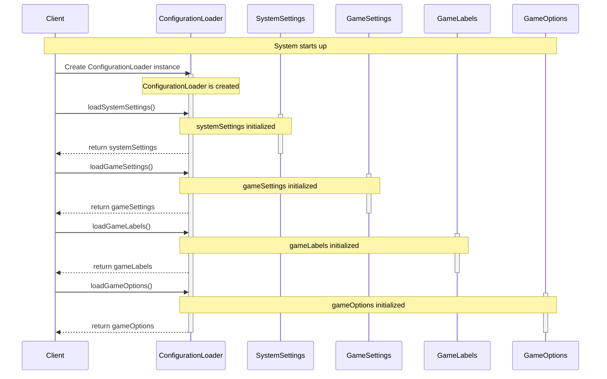

```mermaid
sequenceDiagram
    participant C as Client
    participant CL as ConfigurationLoader
    participant SS as SystemSettings
    participant GS as GameSettings
    participant GL as GameLabels
    participant GO as GameOptions

    Note over C,GO: System starts up
    C->>CL: Create ConfigurationLoader instance
    activate CL
    Note over CL: ConfigurationLoader is created
    C->>CL: loadSystemSettings()
    activate SS
    Note over CL,SS: systemSettings initialized
    CL-->>C: return systemSettings
    deactivate SS
    C->>CL: loadGameSettings()
    activate GS
    Note over CL,GS: gameSettings initialized
    CL-->>C: return gameSettings
    deactivate GS
    C->>CL: loadGameLabels()
    activate GL
    Note over CL,GL: gameLabels initialized
    CL-->>C: return gameLabels
    deactivate GL
    C->>CL: loadGameOptions()
    activate GO
    Note over CL,GO: gameOptions initialized
    CL-->>C: return gameOptions
    deactivate GO
    deactivate CL
```
