# Wretched & Alone Game Mechanics Guide
## Digital Implementation Reference

**Version:** 1.0
**Date:** 2025-11-11
**Purpose:** Complete game mechanics specification for implementation and testing

---

## Table of Contents

1. [Game Overview](#1-game-overview)
2. [Core Components](#2-core-components)
3. [Game Setup](#3-game-setup)
4. [Game Flow](#4-game-flow)
5. [Card Mechanics](#5-card-mechanics)
6. [Special Cards](#6-special-cards)
7. [Win & Loss Conditions](#7-win--loss-conditions)
8. [State Machine](#8-state-machine)
9. [Digital Adaptations](#9-digital-adaptations)
10. [Test Specifications](#10-test-specifications)

---

## 1. Game Overview

### 1.1 Premise

You are the last surviving crew member of the salvage ship **The Wretched**. After an engine failure, your ship was attacked by a hostile alien creature. The crew is dead. The creature survived being jettisoned into space and now crawls on the hull, seeking entry.

### 1.2 Core Themes

- **Isolation**: You are completely alone
- **Survival**: Fighting against inevitable doom
- **Tension**: Every action risks catastrophe
- **Narrative**: Journaling creates your story
- **Mortality**: High likelihood of failure

### 1.3 Game Objectives

**Primary Win Path:** Repair and activate distress beacon, survive until rescue arrives
**Secondary Win Path:** Repair engines and escape (rare/difficult)
**Expected Outcome:** Death (90%+ of games)

### 1.4 Play Time

- **Typical Game:** 20-30 minutes
- **Short Game:** 10-15 minutes (Ace of Hearts on top)
- **Long Game:** 45-60 minutes (lucky draws)

---

## 2. Core Components

### 2.1 Materials Needed

```mermaid
graph TB
    subgraph Physical["Physical Version"]
        A[Standard 52-Card Deck<br/>No Jokers]
        B[Six-Sided Die<br/>1d6]
        C[Tumbling Block Tower<br/>Jenga-style, 54 blocks]
        D[10 Tokens<br/>Nuts/bolts/screws]
        E[Recording Method<br/>Audio/video/journal]
    end

    subgraph Digital["Digital Version"]
        A2[Virtual Card Deck<br/>52 cards shuffled]
        B2[Random Number Generator<br/>1-6]
        C2[Ship Integrity Counter<br/>54 → 0 HP]
        D2[Success Token Counter<br/>10 → 0]
        E2[Text Journal<br/>Database storage]
    end
```



### 2.2 Card Deck Structure

**Total Cards:** 52 (4 suits × 13 ranks)

| Suit | Symbol | Represents | Count |
|------|--------|------------|-------|
| Hearts | ♥ | Ship Systems | 13 |
| Diamonds | ♦ | Ship Structures | 13 |
| Clubs | ♣ | Dead Crew | 13 |
| Spades | ♠ | The Creature | 13 |

**Ranks:** A, 2, 3, 4, 5, 6, 7, 8, 9, 10, J, Q, K

### 2.3 Tower/Ship Integrity


**Physical:** Jenga tower that can collapse unpredictably
**Digital:** HP counter from 54 to 0

### 2.4 Token System

- **Starting Tokens:** 10
- **Purpose:** Track progress toward rescue after beacon activated
- **Win Condition:** Reduce to 0 while ship survives

---

## 3. Game Setup

### 3.1 Setup Sequence


### 3.2 Initial State

```javascript
{
  day: 1,
  shipIntegrity: 54 - initialDamage, // initialDamage = 1d6
  tokens: 10,
  deck: shuffledDeck, // 52 cards
  cardsDrawn: 0,
  kingsRevealed: 0,
  beaconActive: false,
  aceDiamondsDrawn: false,
  gameState: 'active'
}
```

### 3.3 First Log Script

**Required Opening:**
```
Day 1, salvage ship The Wretched. Flight Engineer [YOUR NAME] reporting.
The other members of the crew are dead and the engines remain non-operational,
though ship integrity remains good and life support systems are still active.
I successfully jettisoned the intruder from the airlock, but it remains alive
and continues to try to access the ship. With a little luck I can repair the
distress beacon and somebody will pick me up. This is [YOUR NAME], the last
survivor of the Wretched, signing off.
```

---

## 4. Game Flow

### 4.1 Overall Structure


### 4.2 Each Day (Round)

```mermaid
flowchart TD
    Start([Start of Day X]) --> Phase1[Phase One: The Tasks]

    Phase1 --> Roll[Roll 1d6]
    Roll --> Draw[Draw that many cards face-down]

    Draw --> Turn1{Turn over<br/>next card}
    Turn1 --> Consult[Consult Operations Manual]
    Consult --> Execute[Execute card instructions]

    Execute --> TowerCheck{Does card say<br/>Pull from Tower?}
    TowerCheck -->|Yes| Pull[Pull block from tower<br/>OR roll for damage]
    TowerCheck -->|No| MoreCards
    Pull --> FallCheck{Tower fall?<br/>HP ≤ 0?}

    FallCheck -->|Yes| GameOver[GAME OVER]
    FallCheck -->|No| MoreCards{More cards<br/>to turn?}

    MoreCards -->|Yes| Turn1
    MoreCards -->|No| Discard[Discard used cards]

    Discard --> Phase2[Phase Two: The Log]
    Phase2 --> Reflect[Reflect on the day]
    Phase2 --> Record[Record audio/video log<br/>or journal entry]
    Record --> CheckBeacon{Beacon<br/>active?}

    CheckBeacon -->|Yes| RollBeacon[Roll 1d6 for rescue]
    CheckBeacon -->|No| NextDay

    RollBeacon --> RescueCheck{Rolled<br/>success?}
    RescueCheck -->|Yes| RemoveToken[Remove 1 token]
    RescueCheck -->|No| NextDay

    RemoveToken --> TokenCheck{All tokens<br/>removed?}
    TokenCheck -->|Yes| FinalPull[Final tower pull<br/>OR damage roll]
    TokenCheck -->|No| NextDay

    FinalPull --> FinalCheck{Tower<br/>stand?}
    FinalCheck -->|Yes| Victory[RESCUED<br/>YOU WIN]
    FinalCheck -->|No| GameOver

    NextDay([Next Day])
    Victory([Victory!])
    GameOver([Defeat])
```



### 4.3 Phase One: The Tasks

**Step-by-Step:**

1. **Roll for Tasks**
   - Roll 1d6
   - Result = number of cards to draw (1-6)

2. **Draw Cards**
   - Draw that many cards face-down from deck
   - Keep in order drawn

3. **Process Each Card**
   - Turn over first card
   - Read suit and rank
   - Consult Operations Manual for that specific card
   - Follow all instructions on the card
   - If card says "Pull from the tower", do so

4. **Tower Pulls** (Physical)
   - Remove one block from anywhere below top completed layer
   - Place block on top to complete the top layer
   - If tower falls at ANY TIME → Game Over

5. **Complete Tasks**
   - Continue until all cards processed
   - Discard used cards (unless told otherwise)

### 4.4 Phase Two: The Log

**Step-by-Step:**

1. **Reflect**
   - Consider events of the day
   - Think about ship state
   - Consider creature's actions
   - Note emotional state

2. **Record Log Entry**
   - Begin with: "Day [X], salvage ship The Wretched, Flight Engineer [name] reporting"
   - Summarize the day's events
   - Sign off

3. **Beacon Check** (If Active)
   - Roll 1d6
   - **Base:** 6 = success (remove 1 token)
   - **With Ace♦:** 5 or 6 = success
   - If all tokens removed → Proceed to finale

4. **Continue or End**
   - If not game over, start next day
   - Increment day counter

---

## 5. Card Mechanics

### 5.1 Card Categorization

```mermaid
graph TB
    Deck[52-Card Deck] --> Hearts[Hearts ♥<br/>Ship Systems]
    Deck --> Diamonds[Diamonds ♦<br/>Ship Structures]
    Deck --> Clubs[Clubs ♣<br/>Dead Crew]
    Deck --> Spades[Spades ♠<br/>The Creature]

    Hearts --> H_Face[A♥: Beacon<br/>K♥: Sound in vents<br/>Q♥: Door locks fail<br/>J♥: Engine maintenance]
    Hearts --> H_Num[2-10: Various systems<br/>life support, water,<br/>oxygen, comms, etc.]

    Diamonds --> D_Face[A♦: Boost antenna<br/>K♦: Airlock issue<br/>Q♦: Engine damage<br/>J♦: Power failure]
    Diamonds --> D_Num[2-10: Hull damage,<br/>modules, gravity,<br/>structural issues]

    Clubs --> C_Face[A♣: Find useful tool<br/>K♣: Movement in mess<br/>Q♣: Clear bodies<br/>J♣: Gather bodies]
    Clubs --> C_Num[2-10: Journals,<br/>memories, remains,<br/>relationships]

    Spades --> S_Face[A♠: Distract creature<br/>K♠: Creature dreams<br/>Q♠: Name the creature<br/>J♠: Creature's domain]
    Spades --> S_Num[2-10: Sounds, tracks,<br/>mental toll, physical<br/>evidence, despair]
```



### 5.2 Card Properties

Each card has the following properties:

```typescript
interface Card {
  suit: 'hearts' | 'diamonds' | 'clubs' | 'spades';
  rank: 'A' | '2' | '3' | '4' | '5' | '6' | '7' | '8' | '9' | '10' | 'J' | 'Q' | 'K';
  promptText: string;        // The narrative prompt
  requiresTowerPull: boolean; // Does this card say "Pull from the tower"?
  specialMechanic?: string;   // Special effects (e.g., Ace of Hearts)
  keepVisible?: boolean;      // Keep card out (e.g., Kings)
}
```

### 5.3 Tower Pull Distribution

**Cards that require tower pulls:**

| Suit | Cards with "Pull from tower" | Total |
|------|------------------------------|-------|
| Hearts | 3, 5, 7, 9, 10 | 5 |
| Diamonds | 2, 3, 4, 5, 6, 7, 8, 9, 10, Q, J | 11 |
| Clubs | Q, J | 2 |
| Spades | 2, 3, 4, 5, 6, 7, 8, 9, 10, Q, J | 11 |
| **Total** | | **29/52** |

**Approximately 56% of cards require tower pulls.**

### 5.4 Sample Card Prompts

#### Hearts (Ship Systems)

**H2:** "The water purification system still works, but it's noticeably less efficient. What does it feel like to drink water that smells faintly of ammonia?"

**H5:** "You've been finding it harder and harder to catch your breath, and eventually it dawned on you that the oxygen system had shut itself off. You fixed it, but what caused it to break? **Pull from the tower.**"

**H10:** "The life support system keeps making an unhealthy grinding noise, and you don't know what the problem is. What will you do if it fails?"

#### Diamonds (Ship Structures)

**D3:** "After you threw the creature out of the airlock it spent hours trying to get through the windows of the observatory deck. You fear their integrity has been compromised, so you spend an hour reinforcing them by welding sheets of metal over the inside. **Pull from the tower.**"

**D9:** "Your gravity drive fails. It's a long, slow process dragging yourself over to it with no gravity, and a long day fixing it, but you manage to get it back up and running. **Pull from the tower.**"

#### Clubs (Dead Crew)

**C2:** "You found the journal of one of your crewmates. What thing from home were they missing the most?"

**C7:** "Before the creature came you were in the very early stages of pursuing a relationship with another member of the crew. What was the last thing you said to them, and why do you regret it?"

**CQ:** "You spend a day clearing bodies out of a small room that you intend to hole up in if the creature gets aboard again. What was its purpose before this happened, and why were there so many people here when the creature came? **Pull from the tower.**"

#### Spades (The Creature)

**S3:** "Describe the way the creature moves across the outside of the ship. **Pull from the tower.**"

**S7:** "The creature whispers to you through the ship's comms. You don't know how it does it. What do you hear before you kill the audio? **Pull from the tower.**"

**S10:** "You find something left behind by the creature - blood, or a body part, or something you can't quite explain. Describe it. **Pull from the tower.**"

---

## 6. Special Cards

### 6.1 Aces

```mermaid
graph TB
    Aces[Four Aces] --> AH[Ace of Hearts ♥<br/>BEACON ACTIVATION]
    Aces --> AD[Ace of Diamonds ♦<br/>ANTENNA BOOST]
    Aces --> AC[Ace of Clubs ♣<br/>USEFUL TOOL]
    Aces --> AS[Ace of Spades ♠<br/>DISTRACTION]

    AH --> AH1[Pull from tower]
    AH --> AH2[Place card aside<br/>with 10 tokens on it]
    AH --> AH3[At end of each day:<br/>Roll 1d6]
    AH --> AH4[On 6: Remove 1 token]
    AH --> AH5[When all tokens removed:<br/>Final tower pull]
    AH --> AH6[If tower stands: WIN]

    AD --> AD1[EVA to boost antenna]
    AD --> AD2[Pull from tower]
    AD --> AD3[Keep card visible]
    AD --> AD4[When beacon active:<br/>5 or 6 removes token]

    AC --> AC1[Find a useful tool]
    AC --> AC2[Next tower pull:<br/>May choose not to]

    AS --> AS1[Distract creature]
    AS --> AS2[If King of Spades drawn:<br/>May shuffle it back]
```



### 6.2 Kings


**King Prompts:**

- **K♥:** "You hear a skittering, scraping sound in the air vents and you fear the creature - or something else - may have got aboard the ship. How will you make sure you don't attract its attention?"

- **K♦:** "When you launched the creature out of the airlock you couldn't seal it again. Every now and then the creature comes back to that hole in the side of your ship, scratching and prying at the single internal door that separates you from the cold black of space. How do you react to this?"

- **K♣:** "As you were passing the Officer's Mess you tried to avert your eyes from the carnage inside, but you're sure you saw something move amongst the bodies of your crewmates. What do you think it was?"

- **K♠:** "The past few nights you have been dreaming about the creature. What happens in your dreams?"

**Critical Rule:** All Kings must be kept visible. When the 4th King is drawn, game immediately ends in defeat.

### 6.3 Face Cards (Q, J)

Face cards (Queen, Jack) are treated as **even-numbered** cards in terms of odd/even mechanics, but have specific prompts.

**Queens:**
- **Q♥:** Door lock system fails (tower pull)
- **Q♦:** Engine damage from attempted repair (tower pull, remove block from game)
- **Q♣:** Clear bodies from room (tower pull)
- **Q♠:** Name the creature (tower pull)

**Jacks:**
- **J♥:** Engine maintenance (tower pull)
- **J♦:** Power failure, backup generator fails (tower pull, remove block from game)
- **J♣:** Gather bodies for burial (tower pull)
- **J♠:** Creature's domain (tower pull)

### 6.4 Special Mechanics Summary

| Card | Effect | Mechanic |
|------|--------|----------|
| A♥ | Beacon activation | Place 10 tokens, roll each day, win condition |
| A♦ | Antenna boost | 5 or 6 removes token (instead of just 6) |
| A♣ | Useful tool | Skip next tower pull |
| A♠ | Distract creature | May shuffle K♠ back into deck |
| K (any) | Creature intrusion | 4th King = instant loss |
| Q♦ | Severe engine damage | Tower pull, remove block permanently |
| J♦ | Backup generator fail | Tower pull, remove block permanently |

---

## 7. Win & Loss Conditions

### 7.1 Victory Conditions


**Primary Win Path:**
1. Draw Ace of Hearts → Beacon activated
2. Survive each day's tasks without tower falling
3. Roll for rescue at end of each day (6 = success, or 5-6 with A♦)
4. Remove all 10 tokens
5. Make final tower pull/damage roll
6. Tower still standing → **YOU WIN**

**Probability:**
- Without A♦: (1/6)^10 = 0.00000165% per sequential rolls
- In practice: ~10-20% win rate due to multiple chances per game

**Secondary Win Path:**
- Fix engines and escape (mentioned but no mechanical path provided)
- Considered **impossible** per the Debrief section

### 7.2 Defeat Conditions

```mermaid
flowchart TB
    Playing([Game in Progress]) --> Condition1{Tower falls<br/>during pull?}
    Playing --> Condition2{HP reaches<br/>0 or below?}
    Playing --> Condition3{4th King<br/>revealed?}
    Playing --> Condition4{Deck runs out<br/>before beacon?}
    Playing --> Condition5{Final rescue<br/>roll fails?}

    Condition1 -->|Yes| Loss1[💀 Ship destroyed<br/>Catastrophic failure]
    Condition2 -->|Yes| Loss2[💀 Ship destroyed<br/>Systems failure]
    Condition3 -->|Yes| Loss3[💀 Creature enters<br/>You are killed]
    Condition4 -->|Yes| Loss4[💀 Died before rescue<br/>Time ran out]
    Condition5 -->|Yes| Loss5[💀 Arrived too late<br/>Ship collapses]

    Loss1 --> GameOver[GAME OVER]
    Loss2 --> GameOver
    Loss3 --> GameOver
    Loss4 --> GameOver
    Loss5 --> GameOver
```



**Loss Condition 1: Tower Collapse**
- Physical: Tower falls during any pull
- Digital: HP ≤ 0 after any damage
- **Result:** Catastrophic systems failure

**Loss Condition 2: Four Kings**
- Draw all 4 Kings (any order)
- **Result:** Creature gains access and kills you
- Instant game over

**Loss Condition 3: Deck Exhausted**
- Rare, but possible if beacon not drawn
- **Result:** Died before rescue possible

**Loss Condition 4: Final Pull Fails**
- Beacon countdown complete
- Final tower pull causes collapse
- **Result:** Rescue arrives too late

### 7.3 Outcome Probability


**Typical Distribution:**
- **60%** - Tower/HP reaches 0 before rescue
- **15%** - 4 Kings revealed
- **10%** - Final pull fails
- **5%** - Deck runs out
- **10%** - Victory

---

## 8. State Machine

### 8.1 Complete State Diagram


### 8.2 State Definitions

```typescript
type GameState =
  | 'initialization'    // Creating new game
  | 'setup'             // Building tower, shuffling deck
  | 'firstLog'          // Recording opening log
  | 'dayStart'          // Beginning new day
  | 'rollForTasks'      // Rolling 1d6 for card count
  | 'drawCards'         // Drawing N cards face-down
  | 'processCard'       // Turning over next card
  | 'showPrompt'        // Displaying card prompt
  | 'towerPull'         // Pulling block / rolling damage
  | 'cardComplete'      // Card resolved
  | 'discardCards'      // Moving cards to discard
  | 'specialChecks'     // Checking Kings, Aces, etc.
  | 'beaconActive'      // Beacon countdown active
  | 'beaconRoll'        // Rolling for rescue
  | 'removeToken'       // Token removed from count
  | 'finalPull'         // Last tower pull before rescue
  | 'journalPhase'      // Writing log entry
  | 'recordLog'         // Saving journal
  | 'gameOverState'     // Defeat
  | 'victoryState'      // Victory
  | 'finalLog'          // Closing entry
  | 'exit';             // Game complete

interface GameContext {
  day: number;
  shipIntegrity: number;      // 54 → 0
  tokens: number;             // 10 → 0
  deck: Card[];               // Remaining cards
  hand: Card[];               // Current day's cards
  discard: Card[];            // Used cards
  kingsRevealed: number;      // 0 → 4
  beaconActive: boolean;
  aceDiamondsDrawn: boolean;
  aceClubsDrawn: boolean;
  aceHeartsDrawn: boolean;
  aceSpadesDrawn: boolean;
  kingOfSpadesDrawn: boolean;
  journal: JournalEntry[];
  cardsThisTurn: number;      // From roll
  currentCardIndex: number;
}
```

### 8.3 Transition Rules

```typescript
const transitions = {
  initialization: {
    CREATE_GAME: 'setup'
  },

  setup: {
    SETUP_COMPLETE: 'firstLog'
  },

  firstLog: {
    LOG_RECORDED: 'dayStart'
  },

  dayStart: {
    START_PHASE_ONE: 'rollForTasks'
  },

  rollForTasks: {
    ROLL_COMPLETE: 'drawCards'
  },

  drawCards: {
    CARDS_DRAWN: 'processCard'
  },

  processCard: {
    CARD_TURNED: 'showPrompt'
  },

  showPrompt: {
    PROMPT_READ: 'evaluateCard'
  },

  evaluateCard: {
    TOWER_PULL_REQUIRED: 'towerPull',
    NO_TOWER_PULL: 'cardComplete'
  },

  towerPull: {
    TOWER_FELL: 'gameOverState',
    TOWER_STANDS: 'cardComplete'
  },

  cardComplete: {
    MORE_CARDS: 'processCard',
    ALL_CARDS_DONE: 'discardCards'
  },

  discardCards: {
    CARDS_DISCARDED: 'specialChecks'
  },

  specialChecks: {
    FOUR_KINGS: 'gameOverState',
    BEACON_ACTIVE: 'beaconActive',
    CONTINUE: 'journalPhase'
  },

  beaconActive: {
    ROLL_FOR_RESCUE: 'beaconRoll'
  },

  beaconRoll: {
    RESCUE_SUCCESS: 'removeToken',
    RESCUE_FAILED: 'journalPhase'
  },

  removeToken: {
    ALL_TOKENS_REMOVED: 'finalPull',
    TOKENS_REMAIN: 'journalPhase'
  },

  finalPull: {
    TOWER_STANDS: 'victoryState',
    TOWER_FELL: 'gameOverState'
  },

  journalPhase: {
    START_LOG: 'recordLog'
  },

  recordLog: {
    LOG_COMPLETE_CONTINUE: 'dayStart',
    LOG_COMPLETE_DECK_EMPTY: 'gameOverState'
  },

  gameOverState: {
    RECORD_FINAL_LOG: 'finalLog'
  },

  victoryState: {
    RECORD_FINAL_LOG: 'finalLog'
  },

  finalLog: {
    EXIT_GAME: 'exit'
  }
};
```

---

## 9. Digital Adaptations

### 9.1 Physical vs Digital Comparison

| Physical Mechanic | Challenge | Digital Solution |
|-------------------|-----------|------------------|
| **Jenga Tower** | Requires physical tower, unpredictable collapse | Ship Integrity HP (54 → 0) + damage rolls |
| **Tower Pulls** | Manual dexterity, tension | Failure check: roll 1d6, take damage |
| **Card Shuffling** | Manual shuffle | Fisher-Yates algorithm |
| **Token Placement** | Physical nuts/bolts | Counter variable (10 → 0) |
| **Audio Recording** | Microphone/camera | Text journal with timestamps |
| **Unpredictability** | Tower can fall at any pull | Damage formula creates variance |

### 9.2 Tower Replacement Mechanics

#### Option A: Failure Check System (Recommended)


**Failure Check Formula:**
```javascript
function failureCheck(bonusCounter) {
  const roll = Math.floor(Math.random() * 6) + 1; // 1-6
  const damage = Math.max(roll - bonusCounter, 0);
  return damage;
}

// Usage
if (card.isOdd) {
  const damage = failureCheck(gameState.bonusCounter);
  gameState.shipIntegrity -= damage;

  if (gameState.shipIntegrity <= 0) {
    gameState.status = 'defeat';
  }
}
```

**Bonus Counter:**
- Starts at 0
- Each Ace drawn adds +1
- Max damage reduction: 4 (if all Aces drawn)

**Odd/Even Classification:**
```javascript
const oddCards = ['A', '3', '5', '7', '9'];
const evenCards = ['2', '4', '6', '8', '10', 'J', 'Q', 'K'];

function isOdd(rank) {
  return oddCards.includes(rank);
}
```

#### Option B: Danger Level System

```javascript
interface Card {
  dangerLevel: 0 | 1 | 2 | 3; // Based on source material
}

function processDanger(card) {
  if (card.dangerLevel === 0) {
    // No check needed
    return 0;
  }

  const roll = Math.floor(Math.random() * 6) + 1;
  const threshold = 7 - card.dangerLevel; // 7, 6, 5, 4

  if (roll >= threshold) {
    return 0; // Success, no damage
  } else {
    return card.dangerLevel; // Failed, take damage
  }
}
```

**Danger Level Assignment:**
- **0:** Reflective cards (no tower pull in source)
- **1:** Minor systems (H2, C2, C4, etc.)
- **2:** Major systems (H5, D6, S4, etc.)
- **3:** Critical events (Q♦, J♦, etc.)

#### Option C: Direct Damage Values

Assign fixed damage to cards that require tower pulls:

```javascript
const cardDamage = {
  'H3': 1,
  'H5': 2,
  'H7': 1,
  'H9': 2,
  'H10': 1,
  'D2': 1,
  'D3': 2,
  // ... etc.
  'Q♦': 3, // Severe damage
  'J♦': 3  // Severe damage
};

function applyCardDamage(card) {
  const damage = cardDamage[card.id] || 0;
  gameState.shipIntegrity -= damage;
}
```

### 9.3 Recommended Digital Implementation

**Core Approach:** Hybrid Failure Check System

```mermaid
flowchart TB
    Draw[Draw Card] --> HasPrompt{Card has<br/>pull requirement?}

    HasPrompt -->|Yes| DetermineType{Card type?}
    HasPrompt -->|No| Display[Display prompt only]

    DetermineType -->|Standard| Standard[Roll 1d6<br/>Damage = roll - bonus]
    DetermineType -->|Severe<br/>Q♦, J♦| Severe[Roll 1d6 + 1<br/>Damage = roll - bonus<br/>Min 1]

    Standard --> ApplyDmg[shipIntegrity -= damage]
    Severe --> ApplyDmg

    ApplyDmg --> CheckHP{HP ≤ 0?}
    CheckHP -->|Yes| Loss[Game Over]
    CheckHP -->|No| Display

    Display --> Continue[Continue]
```



**Implementation:**

```javascript
function processCard(card, gameState) {
  // Display prompt
  showPrompt(card.promptText);

  // Check for tower pull requirement
  if (card.requiresTowerPull) {
    const damage = calculateDamage(card, gameState);
    gameState.shipIntegrity -= damage;

    // Log event
    gameState.journal.push({
      type: 'damage',
      card: card.id,
      damage: damage,
      integrity: gameState.shipIntegrity
    });

    // Check for game over
    if (gameState.shipIntegrity <= 0) {
      return triggerDefeat('ship_destroyed');
    }
  }

  // Handle special mechanics
  if (card.specialMechanic) {
    applySpecialMechanic(card, gameState);
  }

  return 'continue';
}

function calculateDamage(card, gameState) {
  const roll = rollD6();
  let baseDamage = roll - gameState.bonusCounter;

  // Severe damage cards (Q♦, J♦)
  if (card.rank === 'Q' && card.suit === 'diamonds' ||
      card.rank === 'J' && card.suit === 'diamonds') {
    baseDamage = (roll + 1) - gameState.bonusCounter;
    baseDamage = Math.max(baseDamage, 1); // Minimum 1 damage
  }

  return Math.max(baseDamage, 0);
}
```

### 9.4 Balancing Considerations

**Target Metrics:**
- **Average Game Length:** 20-30 minutes (15-25 rounds)
- **Win Rate:** 10-20%
- **Average HP at Victory:** 10-20 (out of 54)
- **4 Kings Loss Rate:** ~15%

**Tuning Variables:**
```javascript
const INITIAL_HP = 54;          // Starting ship integrity
const INITIAL_DAMAGE_ROLL = true; // Roll 1d6 damage at start
const BONUS_PER_ACE = 1;        // Damage reduction per Ace
const SEVERE_DAMAGE_BONUS = 1;  // Extra damage for Q♦, J♦
const BEACON_BASE_CHANCE = 6;   // Roll needed without A♦
const BEACON_BOOSTED_CHANCE = 5; // Roll needed with A♦
```

**Difficulty Modes:**

| Mode | Initial HP | Initial Damage | Bonus per Ace | Win Rate |
|------|-----------|----------------|---------------|----------|
| Easy | 60 | No | 2 | ~30% |
| Normal | 54 | Yes (1d6) | 1 | ~15% |
| Hard | 48 | Yes (1d6+2) | 1 | ~5% |
| Nightmare | 40 | Yes (2d6) | 0 | ~1% |

### 9.5 Audio Recording Alternative

**Browser Implementation:**

```javascript
// Optional audio log recording
class AudioLogger {
  constructor() {
    this.mediaRecorder = null;
    this.audioChunks = [];
  }

  async startRecording() {
    const stream = await navigator.mediaDevices.getUserMedia({
      audio: true
    });
    this.mediaRecorder = new MediaRecorder(stream);

    this.mediaRecorder.ondataavailable = (event) => {
      this.audioChunks.push(event.data);
    };

    this.mediaRecorder.start();
  }

  stopRecording() {
    return new Promise((resolve) => {
      this.mediaRecorder.onstop = () => {
        const audioBlob = new Blob(this.audioChunks, {
          type: 'audio/webm'
        });
        const audioUrl = URL.createObjectURL(audioBlob);
        resolve(audioUrl);
      };

      this.mediaRecorder.stop();
    });
  }
}
```

**Text Journal Alternative:**
```javascript
interface JournalEntry {
  day: number;
  timestamp: Date;
  content: string;
  cardsDrawn: string[];    // e.g., ['H5', 'D3', 'S7']
  events: string[];        // Auto-generated summary
  shipIntegrity: number;
  tokensRemaining: number;
}
```

### 9.6 Visual Enhancements

**Ship Integrity Visualization:**

```mermaid
graph LR
    A[54-45<br/>🟢 Pristine] --> B[44-35<br/>🟢 Operational]
    B --> C[34-25<br/>🟡 Damaged]
    C --> D[24-15<br/>🟠 Critical]
    D --> E[14-5<br/>🔴 Failing]
    E --> F[4-0<br/>💀 Destroyed]
```



**Card Animation Sequence:**
1. Deck shuffles with animation
2. Card draws with slide effect
3. Card flips to reveal face
4. Prompt fades in with typewriter effect
5. Damage numbers float upward
6. HP bar depletes with shake effect

**Creature Presence Indicators:**
- Background darkens with each Spade
- Ambient sounds intensify
- Screen edges flash red on King draws
- Subtle scratch marks appear on UI

---

## 10. Test Specifications

### 10.1 Unit Test Requirements

#### Deck Management Tests

```javascript
describe('Deck Management', () => {
  test('should create 52-card deck', () => {
    const deck = createDeck();
    expect(deck).toHaveLength(52);
  });

  test('should have 4 suits with 13 cards each', () => {
    const deck = createDeck();
    const hearts = deck.filter(c => c.suit === 'hearts');
    const diamonds = deck.filter(c => c.suit === 'diamonds');
    const clubs = deck.filter(c => c.suit === 'clubs');
    const spades = deck.filter(c => c.suit === 'spades');

    expect(hearts).toHaveLength(13);
    expect(diamonds).toHaveLength(13);
    expect(clubs).toHaveLength(13);
    expect(spades).toHaveLength(13);
  });

  test('should have all ranks A-K', () => {
    const deck = createDeck();
    const ranks = ['A', '2', '3', '4', '5', '6', '7', '8', '9', '10', 'J', 'Q', 'K'];

    ranks.forEach(rank => {
      const cardsOfRank = deck.filter(c => c.rank === rank);
      expect(cardsOfRank).toHaveLength(4);
    });
  });

  test('should shuffle deck randomly', () => {
    const deck1 = shuffleDeck(createDeck());
    const deck2 = shuffleDeck(createDeck());

    const different = deck1.some((card, i) =>
      card.id !== deck2[i].id
    );
    expect(different).toBe(true);
  });

  test('should draw specified number of cards', () => {
    const gameState = initializeGame();
    drawCards(gameState, 3);

    expect(gameState.hand).toHaveLength(3);
    expect(gameState.deck).toHaveLength(49);
  });

  test('should not draw more cards than remain', () => {
    const gameState = initializeGame();
    gameState.deck = createDeck().slice(0, 2);

    drawCards(gameState, 5);
    expect(gameState.hand).toHaveLength(2);
  });
});
```

#### Game Initialization Tests

```javascript
describe('Game Initialization', () => {
  test('should start with correct initial state', () => {
    const gameState = initializeGame();

    expect(gameState.day).toBe(1);
    expect(gameState.tokens).toBe(10);
    expect(gameState.kingsRevealed).toBe(0);
    expect(gameState.beaconActive).toBe(false);
    expect(gameState.deck).toHaveLength(52);
  });

  test('should apply initial damage to ship integrity', () => {
    const gameState = initializeGame({ initialDamage: true });

    expect(gameState.shipIntegrity).toBeLessThan(54);
    expect(gameState.shipIntegrity).toBeGreaterThanOrEqual(48); // 54 - 6 max
  });

  test('should not apply initial damage when disabled', () => {
    const gameState = initializeGame({ initialDamage: false });

    expect(gameState.shipIntegrity).toBe(54);
  });

  test('should place Ace of Hearts on top for short game', () => {
    const gameState = initializeGame({ shortGame: true });

    expect(gameState.deck[0].rank).toBe('A');
    expect(gameState.deck[0].suit).toBe('hearts');
  });
});
```

#### Damage Calculation Tests

```javascript
describe('Damage Calculation', () => {
  test('should calculate damage correctly with no bonus', () => {
    const gameState = { bonusCounter: 0 };
    const roll = 4;

    const damage = calculateDamage({ requiresTowerPull: true }, gameState, roll);
    expect(damage).toBe(4);
  });

  test('should apply bonus counter to reduce damage', () => {
    const gameState = { bonusCounter: 2 };
    const roll = 4;

    const damage = calculateDamage({ requiresTowerPull: true }, gameState, roll);
    expect(damage).toBe(2); // 4 - 2
  });

  test('should not deal negative damage', () => {
    const gameState = { bonusCounter: 5 };
    const roll = 3;

    const damage = calculateDamage({ requiresTowerPull: true }, gameState, roll);
    expect(damage).toBe(0);
  });

  test('should apply severe damage modifier for Q♦', () => {
    const card = { rank: 'Q', suit: 'diamonds', requiresTowerPull: true };
    const gameState = { bonusCounter: 0 };
    const roll = 4;

    const damage = calculateDamage(card, gameState, roll);
    expect(damage).toBe(5); // 4 + 1
  });

  test('should apply severe damage modifier for J♦', () => {
    const card = { rank: 'J', suit: 'diamonds', requiresTowerPull: true };
    const gameState = { bonusCounter: 0 };
    const roll = 4;

    const damage = calculateDamage(card, gameState, roll);
    expect(damage).toBe(5); // 4 + 1
  });

  test('severe damage should have minimum of 1', () => {
    const card = { rank: 'Q', suit: 'diamonds', requiresTowerPull: true };
    const gameState = { bonusCounter: 5 };
    const roll = 1;

    const damage = calculateDamage(card, gameState, roll);
    expect(damage).toBe(1); // Minimum for severe
  });
});
```

#### Special Card Tests

```javascript
describe('Special Cards', () => {
  describe('Ace of Hearts', () => {
    test('should activate beacon when drawn', () => {
      const gameState = initializeGame();
      processCard({ rank: 'A', suit: 'hearts' }, gameState);

      expect(gameState.beaconActive).toBe(true);
      expect(gameState.aceHeartsDrawn).toBe(true);
    });

    test('should place 10 tokens', () => {
      const gameState = initializeGame();
      processCard({ rank: 'A', suit: 'hearts' }, gameState);

      expect(gameState.tokens).toBe(10);
    });
  });

  describe('Ace of Diamonds', () => {
    test('should mark antenna boosted', () => {
      const gameState = initializeGame();
      processCard({ rank: 'A', suit: 'diamonds' }, gameState);

      expect(gameState.aceDiamondsDrawn).toBe(true);
    });

    test('should allow 5 or 6 for rescue when boosted', () => {
      const gameState = initializeGame();
      gameState.beaconActive = true;
      gameState.aceDiamondsDrawn = true;
      gameState.tokens = 5;

      const result = beaconRoll(gameState, 5);
      expect(result).toBe('success');
      expect(gameState.tokens).toBe(4);
    });

    test('should require 6 for rescue without boost', () => {
      const gameState = initializeGame();
      gameState.beaconActive = true;
      gameState.aceDiamondsDrawn = false;
      gameState.tokens = 5;

      const result = beaconRoll(gameState, 5);
      expect(result).toBe('failure');
      expect(gameState.tokens).toBe(5);
    });
  });

  describe('Ace of Clubs', () => {
    test('should grant skip next tower pull', () => {
      const gameState = initializeGame();
      processCard({ rank: 'A', suit: 'clubs' }, gameState);

      expect(gameState.aceClubsDrawn).toBe(true);
    });

    test('should allow player to skip one tower pull', () => {
      const gameState = initializeGame();
      gameState.aceClubsDrawn = true;

      const canSkip = canSkipTowerPull(gameState);
      expect(canSkip).toBe(true);

      skipTowerPull(gameState);
      expect(gameState.aceClubsDrawn).toBe(false);
    });
  });

  describe('Ace of Spades', () => {
    test('should allow shuffling K♠ back into deck', () => {
      const gameState = initializeGame();
      gameState.kingsRevealed = 1;
      gameState.kingOfSpadesDrawn = true;

      processCard({ rank: 'A', suit: 'spades' }, gameState);

      const canShuffle = canShuffleKingOfSpades(gameState);
      expect(canShuffle).toBe(true);
    });

    test('should shuffle K♠ back and reduce king count', () => {
      const gameState = initializeGame();
      gameState.kingsRevealed = 2;
      gameState.kingOfSpadesDrawn = true;

      shuffleKingOfSpadesBack(gameState);

      expect(gameState.kingOfSpadesDrawn).toBe(false);
      expect(gameState.kingsRevealed).toBe(1);
    });
  });

  describe('Kings', () => {
    test('should track king count', () => {
      const gameState = initializeGame();

      processCard({ rank: 'K', suit: 'hearts' }, gameState);
      expect(gameState.kingsRevealed).toBe(1);

      processCard({ rank: 'K', suit: 'diamonds' }, gameState);
      expect(gameState.kingsRevealed).toBe(2);
    });

    test('should trigger game over on 4th king', () => {
      const gameState = initializeGame();
      gameState.kingsRevealed = 3;

      const result = processCard({ rank: 'K', suit: 'spades' }, gameState);

      expect(result).toBe('defeat');
      expect(gameState.status).toBe('defeat');
      expect(gameState.defeatReason).toBe('four_kings');
    });

    test('should not trigger game over before 4th king', () => {
      const gameState = initializeGame();
      gameState.kingsRevealed = 2;

      const result = processCard({ rank: 'K', suit: 'clubs' }, gameState);

      expect(result).toBe('continue');
      expect(gameState.status).toBe('active');
    });
  });
});
```

#### Win/Loss Condition Tests

```javascript
describe('Win Conditions', () => {
  test('should not win without beacon activation', () => {
    const gameState = initializeGame();
    gameState.tokens = 0;
    gameState.shipIntegrity = 30;

    const result = checkWinCondition(gameState);
    expect(result).toBe(false);
  });

  test('should not win with tokens remaining', () => {
    const gameState = initializeGame();
    gameState.beaconActive = true;
    gameState.tokens = 3;
    gameState.shipIntegrity = 30;

    const result = checkWinCondition(gameState);
    expect(result).toBe(false);
  });

  test('should not win if ship destroyed', () => {
    const gameState = initializeGame();
    gameState.beaconActive = true;
    gameState.tokens = 0;
    gameState.shipIntegrity = 0;

    const result = checkWinCondition(gameState);
    expect(result).toBe(false);
  });

  test('should win when beacon complete and ship intact', () => {
    const gameState = initializeGame();
    gameState.beaconActive = true;
    gameState.tokens = 0;
    gameState.shipIntegrity = 15;

    const result = checkWinCondition(gameState);
    expect(result).toBe(true);
  });

  test('should require final pull before victory', () => {
    const gameState = initializeGame();
    gameState.beaconActive = true;
    gameState.tokens = 1;

    beaconRoll(gameState, 6); // Remove last token

    expect(gameState.tokens).toBe(0);
    expect(gameState.status).toBe('final_pull_required');
  });

  test('final pull success should trigger victory', () => {
    const gameState = initializeGame();
    gameState.beaconActive = true;
    gameState.tokens = 0;
    gameState.shipIntegrity = 20;
    gameState.status = 'final_pull_required';

    finalPull(gameState, 2); // Low damage

    expect(gameState.shipIntegrity).toBeGreaterThan(0);
    expect(gameState.status).toBe('victory');
  });

  test('final pull failure should trigger defeat', () => {
    const gameState = initializeGame();
    gameState.beaconActive = true;
    gameState.tokens = 0;
    gameState.shipIntegrity = 2;
    gameState.status = 'final_pull_required';

    finalPull(gameState, 6); // High damage

    expect(gameState.shipIntegrity).toBeLessThanOrEqual(0);
    expect(gameState.status).toBe('defeat');
  });
});

describe('Loss Conditions', () => {
  test('should lose when ship integrity reaches 0', () => {
    const gameState = initializeGame();
    gameState.shipIntegrity = 2;

    const card = { requiresTowerPull: true };
    processCard(card, gameState, 6); // 6 damage

    expect(gameState.shipIntegrity).toBeLessThanOrEqual(0);
    expect(gameState.status).toBe('defeat');
    expect(gameState.defeatReason).toBe('ship_destroyed');
  });

  test('should lose when 4 kings revealed', () => {
    const gameState = initializeGame();
    gameState.kingsRevealed = 3;

    processCard({ rank: 'K', suit: 'spades' }, gameState);

    expect(gameState.status).toBe('defeat');
    expect(gameState.defeatReason).toBe('four_kings');
  });

  test('should lose when deck exhausted without beacon', () => {
    const gameState = initializeGame();
    gameState.deck = [];
    gameState.beaconActive = false;

    const result = checkEndOfRound(gameState);

    expect(result).toBe('defeat');
    expect(gameState.defeatReason).toBe('deck_exhausted');
  });
});
```

#### Round Progression Tests

```javascript
describe('Round Progression', () => {
  test('should start on day 1', () => {
    const gameState = initializeGame();
    expect(gameState.day).toBe(1);
  });

  test('should increment day after journal phase', () => {
    const gameState = initializeGame();
    completeRound(gameState);

    expect(gameState.day).toBe(2);
  });

  test('should draw 1-6 cards based on roll', () => {
    const gameState = initializeGame();

    for (let roll = 1; roll <= 6; roll++) {
      const state = initializeGame();
      rollForTasks(state, roll);

      expect(state.cardsThisTurn).toBe(roll);
    }
  });

  test('should process all cards in hand', () => {
    const gameState = initializeGame();
    rollForTasks(gameState, 3);
    drawCards(gameState);

    const initialHand = [...gameState.hand];
    processAllCards(gameState);

    expect(gameState.hand).toHaveLength(0);
    expect(gameState.discard.length).toBeGreaterThanOrEqual(3);
  });

  test('should record journal entry', () => {
    const gameState = initializeGame();
    const entry = "Today was difficult...";

    recordJournal(gameState, entry);

    expect(gameState.journal).toHaveLength(1);
    expect(gameState.journal[0].content).toBe(entry);
    expect(gameState.journal[0].day).toBe(1);
  });
});
```

#### Beacon Countdown Tests

```javascript
describe('Beacon Countdown', () => {
  test('should roll for rescue at end of each day', () => {
    const gameState = initializeGame();
    gameState.beaconActive = true;
    gameState.tokens = 8;

    const rolled = jest.fn(() => 4);
    beaconRoll(gameState, rolled());

    expect(rolled).toHaveBeenCalled();
  });

  test('should remove token on roll of 6', () => {
    const gameState = initializeGame();
    gameState.beaconActive = true;
    gameState.tokens = 10;

    beaconRoll(gameState, 6);

    expect(gameState.tokens).toBe(9);
  });

  test('should not remove token on roll < 6 without boost', () => {
    const gameState = initializeGame();
    gameState.beaconActive = true;
    gameState.tokens = 10;
    gameState.aceDiamondsDrawn = false;

    beaconRoll(gameState, 5);

    expect(gameState.tokens).toBe(10);
  });

  test('should remove token on roll 5-6 with boost', () => {
    const gameState = initializeGame();
    gameState.beaconActive = true;
    gameState.tokens = 10;
    gameState.aceDiamondsDrawn = true;

    beaconRoll(gameState, 5);
    expect(gameState.tokens).toBe(9);

    beaconRoll(gameState, 6);
    expect(gameState.tokens).toBe(8);
  });

  test('should track token removal over multiple days', () => {
    const gameState = initializeGame();
    gameState.beaconActive = true;
    gameState.tokens = 10;

    const rolls = [6, 3, 6, 2, 6, 6, 1, 6, 6, 6];
    rolls.forEach(roll => beaconRoll(gameState, roll));

    expect(gameState.tokens).toBe(3); // 7 sixes rolled
  });
});
```

### 10.2 Integration Test Requirements

```javascript
describe('Full Game Integration', () => {
  test('should complete full winning game', () => {
    const gameState = initializeGame({ seed: 'winning-game' });

    // Simulate optimal gameplay
    while (gameState.status === 'active') {
      rollForTasks(gameState, 3); // Moderate pace
      drawCards(gameState);
      processAllCards(gameState);
      recordJournal(gameState, `Day ${gameState.day} log`);

      if (gameState.beaconActive) {
        beaconRoll(gameState, 6); // Always succeed
      }

      if (gameState.day > 100) break; // Safety
    }

    expect(gameState.status).toBe('victory');
  });

  test('should trigger tower collapse defeat', () => {
    const gameState = initializeGame();
    gameState.shipIntegrity = 1;
    gameState.bonusCounter = 0;

    const card = { requiresTowerPull: true };
    processCard(card, gameState, 6);

    expect(gameState.status).toBe('defeat');
    expect(gameState.defeatReason).toBe('ship_destroyed');
  });

  test('should trigger four kings defeat', () => {
    const gameState = initializeGame();

    processCard({ rank: 'K', suit: 'hearts' }, gameState);
    processCard({ rank: 'K', suit: 'diamonds' }, gameState);
    processCard({ rank: 'K', suit: 'clubs' }, gameState);
    processCard({ rank: 'K', suit: 'spades' }, gameState);

    expect(gameState.status).toBe('defeat');
    expect(gameState.defeatReason).toBe('four_kings');
  });

  test('should handle complete beacon countdown', () => {
    const gameState = initializeGame();
    processCard({ rank: 'A', suit: 'hearts' }, gameState);

    expect(gameState.beaconActive).toBe(true);
    expect(gameState.tokens).toBe(10);

    // Simulate 10 successful rescue rolls
    for (let i = 0; i < 10; i++) {
      beaconRoll(gameState, 6);
    }

    expect(gameState.tokens).toBe(0);
    expect(gameState.status).toBe('final_pull_required');
  });
});
```

### 10.3 Balance Testing

```javascript
describe('Game Balance', () => {
  test('should achieve target win rate', () => {
    const iterations = 1000;
    let wins = 0;

    for (let i = 0; i < iterations; i++) {
      const result = simulateGame({ strategy: 'optimal' });
      if (result === 'victory') wins++;
    }

    const winRate = wins / iterations;
    expect(winRate).toBeGreaterThan(0.05);  // At least 5%
    expect(winRate).toBeLessThan(0.30);     // Less than 30%
  });

  test('should last 15-30 rounds on average', () => {
    const iterations = 100;
    let totalRounds = 0;

    for (let i = 0; i < iterations; i++) {
      const result = simulateGame({ trackRounds: true });
      totalRounds += result.rounds;
    }

    const avgRounds = totalRounds / iterations;
    expect(avgRounds).toBeGreaterThan(10);
    expect(avgRounds).toBeLessThan(40);
  });

  test('four kings should account for ~15% of losses', () => {
    const iterations = 500;
    let fourKingsDefeats = 0;
    let totalDefeats = 0;

    for (let i = 0; i < iterations; i++) {
      const result = simulateGame();
      if (result.status === 'defeat') {
        totalDefeats++;
        if (result.reason === 'four_kings') {
          fourKingsDefeats++;
        }
      }
    }

    const kingDefeats = fourKingsDefeats / totalDefeats;
    expect(kingDefeats).toBeGreaterThan(0.10);
    expect(kingDefeats).toBeLessThan(0.25);
  });
});
```

### 10.4 Card Prompt Tests

```javascript
describe('Card Prompts', () => {
  test('should have prompt for all 52 cards', () => {
    const prompts = loadCardPrompts();

    expect(Object.keys(prompts)).toHaveLength(52);
  });

  test('should have valid prompt text', () => {
    const prompts = loadCardPrompts();

    Object.values(prompts).forEach(prompt => {
      expect(prompt.text).toBeTruthy();
      expect(prompt.text.length).toBeGreaterThan(10);
    });
  });

  test('should correctly identify cards requiring tower pulls', () => {
    const prompts = loadCardPrompts();

    // Count cards with requiresTowerPull: true
    const pullCards = Object.values(prompts).filter(
      p => p.requiresTowerPull
    );

    // Should be approximately 29 cards
    expect(pullCards.length).toBeGreaterThan(25);
    expect(pullCards.length).toBeLessThan(35);
  });

  test('should have special mechanics for aces', () => {
    const prompts = loadCardPrompts();

    expect(prompts['HA'].specialMechanic).toBe('beacon_activation');
    expect(prompts['DA'].specialMechanic).toBe('antenna_boost');
    expect(prompts['CA'].specialMechanic).toBe('skip_tower_pull');
    expect(prompts['SA'].specialMechanic).toBe('shuffle_king_spades');
  });

  test('should mark kings as keep visible', () => {
    const prompts = loadCardPrompts();

    expect(prompts['HK'].keepVisible).toBe(true);
    expect(prompts['DK'].keepVisible).toBe(true);
    expect(prompts['CK'].keepVisible).toBe(true);
    expect(prompts['SK'].keepVisible).toBe(true);
  });
});
```

### 10.5 Performance Tests

```javascript
describe('Performance', () => {
  test('should initialize game in < 100ms', () => {
    const start = performance.now();
    const gameState = initializeGame();
    const end = performance.now();

    expect(end - start).toBeLessThan(100);
  });

  test('should process card in < 10ms', () => {
    const gameState = initializeGame();
    const card = { rank: '5', suit: 'hearts', requiresTowerPull: true };

    const start = performance.now();
    processCard(card, gameState);
    const end = performance.now();

    expect(end - start).toBeLessThan(10);
  });

  test('should handle 1000 games without memory leak', () => {
    const initialMemory = performance.memory?.usedJSHeapSize || 0;

    for (let i = 0; i < 1000; i++) {
      simulateGame({ fast: true });
    }

    const finalMemory = performance.memory?.usedJSHeapSize || 0;
    const growth = finalMemory - initialMemory;

    // Memory should not grow by more than 10MB
    expect(growth).toBeLessThan(10 * 1024 * 1024);
  });
});
```

### 10.6 Edge Case Tests

```javascript
describe('Edge Cases', () => {
  test('should handle drawing last card in deck', () => {
    const gameState = initializeGame();
    gameState.deck = [createCard('H', 'A')];

    drawCards(gameState, 1);

    expect(gameState.hand).toHaveLength(1);
    expect(gameState.deck).toHaveLength(0);
  });

  test('should handle Ace of Hearts as first card', () => {
    const gameState = initializeGame({ shortGame: true });

    rollForTasks(gameState, 1);
    drawCards(gameState);
    processAllCards(gameState);

    expect(gameState.beaconActive).toBe(true);
    expect(gameState.day).toBe(1);
  });

  test('should handle all aces drawn before beacon', () => {
    const gameState = initializeGame();

    processCard({ rank: 'A', suit: 'diamonds' }, gameState);
    processCard({ rank: 'A', suit: 'clubs' }, gameState);
    processCard({ rank: 'A', suit: 'spades' }, gameState);

    expect(gameState.bonusCounter).toBe(3);

    processCard({ rank: 'A', suit: 'hearts' }, gameState);

    expect(gameState.bonusCounter).toBe(4);
    expect(gameState.beaconActive).toBe(true);
  });

  test('should handle taking exactly lethal damage', () => {
    const gameState = initializeGame();
    gameState.shipIntegrity = 3;
    gameState.bonusCounter = 0;

    const card = { requiresTowerPull: true };
    processCard(card, gameState, 3); // Exactly 3 damage

    expect(gameState.shipIntegrity).toBe(0);
    expect(gameState.status).toBe('defeat');
  });

  test('should handle Ace of Clubs after already used', () => {
    const gameState = initializeGame();
    processCard({ rank: 'A', suit: 'clubs' }, gameState);

    expect(gameState.aceClubsDrawn).toBe(true);

    skipTowerPull(gameState);
    expect(gameState.aceClubsDrawn).toBe(false);

    const canSkipAgain = canSkipTowerPull(gameState);
    expect(canSkipAgain).toBe(false);
  });

  test('should handle Ace of Spades with no King of Spades drawn', () => {
    const gameState = initializeGame();
    gameState.kingOfSpadesDrawn = false;

    processCard({ rank: 'A', suit: 'spades' }, gameState);

    const canShuffle = canShuffleKingOfSpades(gameState);
    expect(canShuffle).toBe(false);
  });
});
```

---

## Appendix A: Quick Reference

### Card ID Format

```
Format: [Suit][Rank]
Examples:
  H5  = Five of Hearts
  DA  = Ace of Diamonds
  CK  = King of Clubs
  S10 = Ten of Spades
```

### State Variables

```javascript
{
  day: number,                    // Current day (1+)
  shipIntegrity: number,          // HP (54 → 0)
  tokens: number,                 // Rescue countdown (10 → 0)
  deck: Card[],                   // Remaining cards
  hand: Card[],                   // Current turn cards
  discard: Card[],                // Used cards
  kingsRevealed: number,          // Kings drawn (0-4)
  bonusCounter: number,           // Aces drawn (0-4)
  beaconActive: boolean,          // Ace♥ drawn?
  aceDiamondsDrawn: boolean,      // A♦ drawn?
  aceClubsDrawn: boolean,         // A♣ available?
  aceSpadesDrawn: boolean,        // A♠ drawn?
  kingOfSpadesDrawn: boolean,     // K♠ drawn?
  status: GameStatus,             // Current state
  defeatReason?: string,          // Why lost
  journal: JournalEntry[]         // Log entries
}
```

### Roll Outcomes

| Roll | Damage (no bonus) | With +1 Bonus | With +4 Bonus |
|------|-------------------|---------------|---------------|
| 1 | 1 | 0 | 0 |
| 2 | 2 | 1 | 0 |
| 3 | 3 | 2 | 0 |
| 4 | 4 | 3 | 0 |
| 5 | 5 | 4 | 1 |
| 6 | 6 | 5 | 2 |

### Rescue Roll Success

| Condition | Success On |
|-----------|------------|
| Base (no A♦) | 6 only |
| With A♦ | 5 or 6 |
| Probability (no A♦) | 16.67% |
| Probability (with A♦) | 33.33% |

---

## Appendix B: Glossary

**Beacon:** Distress signal activated by Ace of Hearts
**Bonus Counter:** Damage reduction from Aces (max +4)
**Creature:** Hostile alien entity hunting the player
**Deck Exhaustion:** Running out of cards before winning
**Failure Check:** Roll for damage when card requires it
**Final Pull:** Last damage roll before rescue arrives
**Four Kings:** Instant loss condition
**Operations Manual:** Card prompt reference (pages 14-21)
**Phase One:** Task phase (draw and process cards)
**Phase Two:** Log phase (journal entry)
**Salvage Ship:** The Wretched spacecraft
**Ship Integrity:** Health/durability of spacecraft (54 HP)
**Tower:** Physical Jenga tower or digital HP equivalent
**Tower Pull:** Removing block or rolling for damage
**Win Condition:** Beacon complete + ship intact

---

**End of Document**

*This guide is based on The Wretched by Chris Bissette (Loot The Room) and the Wretched & Alone SRD. All mechanics described are derived from the source material for digital implementation purposes.*
