# Wretched & Alone Framework - Game Mechanics Guide

## Digital Implementation Reference (Story-Agnostic)

**Version:** 2.0
**Date:** 2025-11-11
**Purpose:** Complete framework mechanics specification for implementation and testing
**Damage System:** Option A - Failure Check System (Odd Cards + Damage Roll)

---

## Table of Contents

1. [Framework Overview](#1-framework-overview)
2. [Core Components](#2-core-components)
3. [Game Setup](#3-game-setup)
4. [Game Flow](#4-game-flow)
5. [Card Mechanics](#5-card-mechanics)
6. [Special Cards](#6-special-cards)
7. [Win & Loss Conditions](#7-win--loss-conditions)
8. [State Machine](#8-state-machine)
9. [Damage System (Option A)](#9-damage-system-option-a)
10. [Test Specifications](#10-test-specifications)

---

## 1. Framework Overview

### 1.1 Framework Concept

The Wretched & Alone framework is a **solo journaling RPG system** that creates:

- **Escalating Tension**: Progressive threat through resource depletion
- **Inevitable Doom**: High difficulty with low win rate (~10-20%)
- **Narrative Emergence**: Story created through card prompts and journaling
- **Simple Mechanics**: Card draws, dice rolls, and resource tracking
- **Dual-Phase Structure**: Action phase + reflection phase

### 1.2 Core Objectives

**Primary Win Path:**

- Activate special win condition (Ace of designated suit)
- Complete countdown mechanic (10 → 0 tokens)
- Survive final risk check with resources intact

**Expected Outcome:** Failure (80-90% of games)

### 1.3 Play Time

- **Typical Game:** 20-30 minutes
- **Short Game:** 10-15 minutes (win card on top)
- **Long Game:** 45-60 minutes (lucky draws)

---

## 2. Core Components

### 2.1 Materials Required

```mermaid
graph TB
    subgraph Physical["Physical Table Version"]
        A[Standard 52-Card Deck<br/>No Jokers]
        B[Six-Sided Die<br/>1d6]
        C[Resource Tracker<br/>Physical tower/54 blocks]
        D[10 Success Tokens<br/>Any small objects]
        E[Recording Method<br/>Audio/video/journal]
    end

    subgraph Digital["Digital Implementation"]
        A2[Virtual Card Deck<br/>52 cards shuffled]
        B2[Random Number Generator<br/>1-6]
        C2[Resource Counter<br/>54 → 0 HP]
        D2[Success Token Counter<br/>10 → 0]
        E2[Text Journal<br/>Database storage]
    end
```



### 2.2 Card Deck Structure

**Total Cards:** 52 (4 suits × 13 ranks)

| Suit | Symbol | Thematic Category | Count |
|------|--------|-------------------|-------|
| Suit A (Hearts) | ♥ | Category 1 | 13 |
| Suit B (Diamonds) | ♦ | Category 2 | 13 |
| Suit C (Clubs) | ♣ | Category 3 | 13 |
| Suit D (Spades) | ♠ | Category 4 | 13 |

**Ranks:** A, 2, 3, 4, 5, 6, 7, 8, 9, 10, J, Q, K

**Card Classification:**

- **Damage Ranks:** 3, 5, 7, 9 (trigger damage checks)
- **Safe Ranks:** 2, 4, 6, 8, 10, J, Q (safe from damage)
- **Kings (K):** 4 total - Failure counters (even-ranked, no damage)
- **Narrative Cards (Aces):** A♦, A♣, A♠ (bonus cards, do NOT trigger damage unless modified)
- **Primary Success:** A♥ (Ace of Hearts - special win condition, no automatic damage)
- **Note**: Aces are treated as "bonus/help" cards and provide moments of respite

### 2.3 Resource System


**Resource Tracking:**

- **Physical:** Tower that collapses on critical failure
- **Digital:** HP counter from 54 to 0

**Accessibility Note (Core SRD Principle):**
The Wretched and Alone SRD emphasizes that **tower/damage mechanics should be optional** to ensure accessibility. Games should be playable without physical components or randomized failure. The digital implementation should make tower mechanics:

- **Configurable**: Allow players to disable damage checks if desired
- **Alternative modes**: Provide narrative-only mode for those who prefer pure journaling
- **Transparent**: Clearly show when damage checks occur and why
- This preserves the core SRD value of accessibility for all players

### 2.4 Token System

- **Starting Tokens:** 10
- **Purpose:** Track progress toward win condition
- **Win Requirement:** Reduce to 0 while resources remain > 0

---

## 3. Game Setup

### 3.1 Setup Sequence


### 3.2 Initial State

```typescript
interface GameState {
  day: number;                    // Starts at 1
  resources: number;              // 54 - initialDamage (1d6)
                                  // Note: Initial damage roll is a digital
                                  // enhancement for balance, not in original SRD
  tokens: number;                 // Starts at 10
  deck: Card[];                   // Shuffled 52 cards
  cardsDrawn: number;             // Starts at 0
  trackersRevealed: number;       // Tracker cards (e.g., Kings) revealed (0-4)
  winConditionActive: boolean;    // Win card drawn? (false)
  bonusCounter: number;           // Bonus cards drawn (0-4)
  gameStatus: GameStatus;         // 'active' | 'victory' | 'defeat'
}
```

**Digital Enhancements vs SRD:**

- **Initial 1d6 damage roll**: Added for digital balance (not in original SRD)
- **Resource counter (54 HP)**: Digital equivalent of physical tower (SRD uses tower)
- **Bonus counter mechanics**: Aligned with SRD "bonus/help" concept for Aces

### 3.3 Opening Journal Entry

Players should record an opening entry that establishes:

- Character identity
- Current situation
- Initial state of resources
- Goals and objectives

This is **story-specific** and not defined by the framework.

---

## 4. Game Flow

### 4.1 Overall Structure


### 4.2 Each Day (Round)


### 4.3 Phase One: Actions

**Step-by-Step:**

1. **Roll for Card Count**
   - Roll 1d6
   - Result = number of cards to draw (1-6)

2. **Draw Cards**
   - Draw that many cards face-down from deck
   - Keep in order drawn

3. **Process Each Card**
   - Turn over first card
   - Note suit and rank
   - Display card's narrative prompt (story-specific)
   - Apply card mechanics

4. **Damage Check** (Option A - Failure Check System)
   - **If card rank is ODD (A, 3, 5, 7, 9):**
     - **Usually** roll 1d6 per SRD (designer flexibility preserved)
     - Calculate: `damage = max(roll - bonusCounter, 0)`
     - Apply: `resources -= damage`
     - If resources ≤ 0 → Game Over
   - **If card rank is EVEN (2, 4, 6, 8, 10, J, Q, K):**
     - **Usually** no damage check required per SRD
     - Continue to next card

5. **Special Card Checks**
   - Check for special mechanics (Aces, Kings, etc.)
   - Apply effects immediately

6. **Complete Actions**
   - Continue until all cards processed
   - Discard used cards

### 4.4 Phase Two: Journal

**Step-by-Step:**

1. **Reflect**
   - Consider events of the day
   - Think about resource state
   - Note emotional state
   - Plan next actions

2. **Record Entry**
   - Write/record journal entry
   - Summarize day's events
   - This is **story-specific**

3. **Win Condition Check** (If Active)
   - Roll 1d6
   - **Base:** 6 = success (remove 1 token)
   - **With Bonus (optional):** 5-6 = success
   - If all tokens removed → Proceed to finale

4. **Continue or End**
   - If not game over, start next day
   - Increment day counter

---

## 5. Card Mechanics

### 5.1 Card Properties

```typescript
interface Card {
  suit: 'hearts' | 'diamonds' | 'clubs' | 'spades';
  rank: 'A' | '2' | '3' | '4' | '5' | '6' | '7' | '8' | '9' | '10' | 'J' | 'Q' | 'K';
  promptText: string;           // Story-specific narrative
  requiresDamageCheck: boolean; // TRUE if odd rank
  specialMechanic?: string;     // Special card effects
  keepVisible?: boolean;        // Keep card displayed (e.g., tracker cards)
}
```

### 5.2 Odd vs Even Classification


**Implementation:**

```typescript
function requiresDamageCheck(card: Card): boolean {
  const damageRanks = ['3', '5', '7', '9'];
  return damageRanks.includes(card.rank);
}
```

### 5.3 Card Distribution

| Rank | Count | Triggers Damage? | Notes |
|------|-------|------------------|-------|
| A | 4 | ❌ No | Bonus/help cards - provide respite and reduce damage |
| 2 | 4 | ❌ No | Even-ranked |
| 3 | 4 | ✅ Yes | Odd-ranked challenge |
| 4 | 4 | ❌ No | Even-ranked |
| 5 | 4 | ✅ Yes | Odd-ranked challenge |
| 6 | 4 | ❌ No | Even-ranked |
| 7 | 4 | ✅ Yes | Odd-ranked challenge |
| 8 | 4 | ❌ No | Even-ranked |
| 9 | 4 | ✅ Yes | Odd-ranked challenge |
| 10 | 4 | ❌ No | Even-ranked |
| J | 4 | ❌ No | Even-valued face card |
| Q | 4 | ❌ No | Even-valued face card |
| K | 4 | ❌ No | Even-valued, Tracker cards (see Special Cards) |

**Total Damage-Triggering Cards:** 16 out of 52 (~31%)

**Important Note on Aces:**
Aces are "bonus or help in your plight" per the SRD and do NOT trigger damage checks. They provide pure respite - adding to the bonus counter to reduce future damage. This creates moments of genuine hope where help doesn't come with immediate risk.

---

## 6. Special Cards

### 6.1 Card Type Categories


### 6.2 Ace Mechanics

**Ace Classification:**

1. **Win Condition Card** (typically Ace of designated suit)
   - Activates win condition pathway
   - Places 10 tokens
   - Begins countdown mechanic

2. **Bonus Counter Cards** (all Aces)
   - Each Ace drawn adds +1 to bonus counter
   - Bonus counter reduces damage taken
   - Max bonus: +4 (all four Aces)

**IMPORTANT: Aces Do NOT Trigger Damage**

Per the Wretched and Alone SRD, **Aces are "bonus or help" cards and do NOT trigger tower pulls**:

- Aces provide pure moments of respite and hope
- Each Ace adds +1 to bonus counter (reduces future damage)
- Standard damage-triggering cards: 3, 5, 7, 9 only (16 cards total, ~31%)
- This creates a balanced mix of danger (16 cards) and safety/help (36 cards)

**Design Philosophy:**

Aces represent moments of genuine help without immediate cost. While the game is difficult and failure is expected, these cards provide:
- Breathing room between challenges
- Narrative space for reflection and character development
- Mechanical relief through bonus accumulation
- Hope that sustains the player through darker moments

**Cards Can Have Special Modifiers:**

Narrative cards (Aces) can optionally have special one-time effects through modifiers:

- **Example 1**: Ace with skip-damage modifier allows skipping next damage check
- **Example 2**: Ace with return-king modifier allows shuffling a King back into deck

These modifiers are optional enhancements, not core mechanics.

**Special One-Time Ace Mechanics:**

Per The Wretched implementation, **two special mechanics can be assigned to Ace cards** (one card per mechanic, once per game):

**1. Skip Tower Pull Mechanic**

- Allows player to skip the next tower pull when instructed
- Can only be assigned to ONE Ace card in the deck
- Example text: *"The next time you are told to pull from the tower you may choose not to"*
- Example from The Wretched: Ace of Clubs
- Strategic use: Save for critical moments when resources are low

**2. Return King Mechanic**

- Allows player to shuffle a previously drawn King back into the deck
- Can only be assigned to ONE Ace card in the deck
- Specifically targets King of Spades in The Wretched
- Example text: *"If you have previously drawn the King of Spades you may shuffle it back into the deck"*
- Example from The Wretched: Ace of Spades
- Strategic use: Resets the tracker count, providing critical relief

**Design Notes:**

- These are optional advanced mechanics from The Wretched
- Each mechanic can only be used once per game
- Provides strategic relief from escalating tension
- Maintains SRD compliance while adding tactical depth
- Game designers may create additional one-time mechanics following this pattern

**Example:**

```typescript
function processAce(card: Card, gameState: GameState): void {
  // All Aces add to bonus counter
  gameState.bonusCounter++;

  // Check if this is the win condition card
  if (card.suit === 'hearts' && card.rank === 'A') {
    gameState.winConditionActive = true;
    gameState.tokens = 10;
  }

  // IMPORTANT: Ace is odd-ranked, so it STILL triggers damage check
  // This happens even though the Ace provides a bonus
  // The bonus reduces THIS damage and future damage
  if (isOddRank(card.rank)) {
    performDamageCheck(card, gameState);
  }
}
```

### 6.3 Tracker Cards (Kings)


**Tracker Card Rules:**

- **Keep Visible:** All tracker cards must remain displayed
- **Count Tracks:** Track total number revealed (0-4)
- **Instant Loss:** When 4th tracker revealed → immediate defeat
- **No Damage:** Tracker cards are even rank (King = no damage check)

**Implementation:**

```typescript
function processTrackerCard(card: Card, gameState: GameState): void {
  // Increment tracker count
  gameState.trackersRevealed++;

  // Keep card visible
  gameState.visibleCards.push(card);

  // Check for instant loss
  if (gameState.trackersRevealed >= 4) {
    gameState.gameStatus = 'defeat';
    gameState.defeatReason = 'tracker_limit';
  }
}
```

### 6.4 Special Mechanics Summary

| Card Type | Effect | Mechanic |
|-----------|--------|----------|
| Win Ace | Activate win condition | Place 10 tokens, begin countdown |
| All Aces | Increase bonus counter | +1 damage reduction per Ace |
| Tracker Cards | Progress toward loss | 4th tracker = instant defeat |
| Modifier Cards | Enhanced effects | Story-specific, optional |

**Optional Ace Enhancements:**

- **Bonus Ace:** Win condition rolls succeed on 5-6 instead of just 6
- **Skip Ace:** Next damage check can be skipped once
- **Reversal Ace:** Can remove one tracker card from game (once)

---

## 7. Win & Loss Conditions

### 7.1 Victory Path


**Victory Requirements:**

1. Draw win condition card (designated Ace)
2. Survive with resources > 0
3. Roll for progress at end of each day
4. Successfully remove all 10 tokens
5. **Make final damage roll** (SRD: "may come with a final pull from the tower")
6. Resources still > 0 → **WIN**

**Win Probability:**

- Base chance per roll: 1/6 (16.67%)
- With bonus: 2/6 (33.33%)
- Typical win rate: 10-20% of games

**Final Damage Roll (Dramatic Tension):**
Per the SRD, achieving salvation "may come with a final pull from the tower." This creates maximum dramatic tension - you can complete the entire countdown successfully, only to fail at the very last moment due to the final damage roll. This reinforces the SRD's core theme: the journey matters more than victory, and victory is never guaranteed.

### 7.2 Defeat Conditions

```mermaid
flowchart TB
    Playing([Game in Progress]) --> Condition1{Resources<br/>reach 0?}
    Playing --> Condition2{4 Tracker Cards<br/>revealed?}
    Playing --> Condition3{Deck runs out<br/>before win?}
    Playing --> Condition4{Final roll<br/>depletes resources?}

    Condition1 -->|Yes| Loss1[💀 Resources Depleted<br/>Critical Failure]
    Condition2 -->|Yes| Loss2[💀 Tracker Limit<br/>Instant Loss]
    Condition3 -->|Yes| Loss3[💀 Time Expired<br/>Deck Exhausted]
    Condition4 -->|Yes| Loss4[💀 Final Roll Failed<br/>Too Late]

    Loss1 --> GameOver[GAME OVER]
    Loss2 --> GameOver
    Loss3 --> GameOver
    Loss4 --> GameOver
```



**Loss Conditions:**

1. **Resources Depleted:** Resources ≤ 0 after any damage check
2. **Tracker Limit:** 4 tracker cards (Kings) revealed
3. **Deck Exhaustion:** All cards drawn before win condition met (rare)
4. **Final Roll Failure:** Win countdown complete, but final damage depletes resources

### 7.3 Expected Outcome Distribution


**Typical Distribution:**

- **60%** - Resources depleted before win
- **15%** - Tracker limit reached
- **10%** - Final roll fails
- **5%** - Deck exhaustion
- **10%** - Victory

---

## 8. State Machine

### 8.1 Complete State Diagram

```mermaid
stateDiagram-v2
    [*] --> Initialization

    Initialization --> Setup: Create game
    Setup --> FirstEntry: Record opening
    FirstEntry --> DayStart: Begin Day 1

    DayStart --> RollForCards: Phase One
    RollForCards --> DrawCards: Roll complete
    DrawCards --> ProcessCard: Draw N cards

    ProcessCard --> ShowPrompt: Turn over card
    ShowPrompt --> CheckCard: Evaluate card

    CheckCard --> DamageCheck: Odd rank?
    DamageCheck --> RollDamage: Yes, roll 1d6
    DamageCheck --> CardComplete: No, continue

    RollDamage --> ApplyDamage: Calculate damage
    ApplyDamage --> ResourceCheck: Check resources

    ResourceCheck --> GameOverState: Resources ≤ 0
    ResourceCheck --> CardComplete: Resources > 0

    CardComplete --> MoreCards: Check remaining
    MoreCards --> ProcessCard: Yes, next card
    MoreCards --> DiscardCards: No, done

    DiscardCards --> SpecialChecks: Check special cards
    SpecialChecks --> TrackerCheck: Count trackers
    TrackerCheck --> GameOverState: 4 trackers
    TrackerCheck --> WinCheck: < 4 trackers

    WinCheck --> WinActive: Win card drawn?
    WinCheck --> JournalPhase: Not yet

    WinActive --> WinRoll: Roll for progress
    WinRoll --> TokenSuccess: Check result
    TokenSuccess --> RemoveToken: Success!
    TokenSuccess --> JournalPhase: Failed roll

    RemoveToken --> AllTokensGone: Check count
    AllTokensGone --> FinalDamage: All removed
    AllTokensGone --> JournalPhase: Tokens remain

    FinalDamage --> FinalResourceCheck: Check resources
    FinalResourceCheck --> VictoryState: Resources > 0
    FinalResourceCheck --> GameOverState: Resources ≤ 0

    JournalPhase --> RecordEntry: Phase Two
    RecordEntry --> DeckCheck: Entry recorded
    DeckCheck --> DayStart: Cards remain
    DeckCheck --> GameOverState: Deck empty

    GameOverState --> FinalEntry: Record final
    FinalEntry --> [*]: Exit game

    VictoryState --> FinalEntry: Record victory
```



### 8.2 State Definitions

```typescript
type GameState =
  | 'initialization'    // Creating new game
  | 'setup'             // Initializing resources
  | 'firstEntry'        // Recording opening
  | 'dayStart'          // Beginning new day
  | 'rollForCards'      // Rolling 1d6 for card count
  | 'drawCards'         // Drawing N cards
  | 'processCard'       // Processing next card
  | 'showPrompt'        // Displaying card prompt
  | 'damageCheck'       // Checking if odd rank
  | 'rollDamage'        // Rolling damage
  | 'applyDamage'       // Applying damage to resources
  | 'cardComplete'      // Card resolved
  | 'discardCards'      // Moving cards to discard
  | 'specialChecks'     // Checking Aces, Kings, etc.
  | 'winActive'         // Win condition countdown
  | 'winRoll'           // Rolling for progress
  | 'removeToken'       // Token removed
  | 'finalDamage'       // Final damage roll
  | 'journalPhase'      // Writing entry
  | 'recordEntry'       // Saving journal
  | 'gameOverState'     // Defeat
  | 'victoryState'      // Victory
  | 'finalEntry'        // Closing entry
  | 'exit';             // Game complete

interface GameContext {
  day: number;
  resources: number;            // 54 → 0
  tokens: number;               // 10 → 0
  deck: Card[];                 // Remaining cards
  hand: Card[];                 // Current day's cards
  discard: Card[];              // Used cards
  trackersRevealed: number;     // 0 → 4
  bonusCounter: number;         // 0 → 4
  winConditionActive: boolean;
  journal: JournalEntry[];
  cardsThisTurn: number;
  currentCardIndex: number;
  gameStatus: 'active' | 'victory' | 'defeat';
  defeatReason?: string;
}
```

---

## 9. Damage System (Option A)

### 9.1 Failure Check System Overview

**Core Concept:** Odd-ranked cards trigger a damage roll, creating tension without physical components.


### 9.2 Damage Formula

```typescript
function calculateDamage(roll: number, bonusCounter: number): number {
  const damage = Math.max(roll - bonusCounter, 0);
  return damage;
}

function performDamageCheck(card: Card, gameState: GameState): void {
  // Only challenge cards (3, 5, 7, 9) trigger damage
  const damageRanks = ['3', '5', '7', '9'];
  if (!damageRanks.includes(card.rank)) {
    return;
  }

  // Roll 1d6
  const roll = rollD6(); // Returns 1-6

  // Calculate damage
  const damage = calculateDamage(roll, gameState.bonusCounter);

  // Apply damage
  gameState.resources -= damage;

  // Log event
  gameState.journal.push({
    type: 'damage',
    day: gameState.day,
    card: card.id,
    roll: roll,
    bonusCounter: gameState.bonusCounter,
    damage: damage,
    resourcesRemaining: gameState.resources
  });

  // Check for game over
  if (gameState.resources <= 0) {
    gameState.gameStatus = 'defeat';
    gameState.defeatReason = 'resources_depleted';
  }
}
```

### 9.3 Damage Tables

**Without Bonus Counter (bonusCounter = 0):**

| Roll | Damage | Resources After (from 54) |
|------|--------|---------------------------|
| 1 | 1 | 53 |
| 2 | 2 | 52 |
| 3 | 3 | 51 |
| 4 | 4 | 50 |
| 5 | 5 | 49 |
| 6 | 6 | 48 |

**With Bonus Counter +2 (bonusCounter = 2):**

| Roll | Damage | Resources After (from 54) |
|------|--------|---------------------------|
| 1 | 0 | 54 (no damage) |
| 2 | 0 | 54 (no damage) |
| 3 | 1 | 53 |
| 4 | 2 | 52 |
| 5 | 3 | 51 |
| 6 | 4 | 50 |

**With Bonus Counter +4 (bonusCounter = 4 - all Aces):**

| Roll | Damage | Resources After (from 54) |
|------|--------|---------------------------|
| 1 | 0 | 54 (no damage) |
| 2 | 0 | 54 (no damage) |
| 3 | 0 | 54 (no damage) |
| 4 | 0 | 54 (no damage) |
| 5 | 1 | 53 |
| 6 | 2 | 52 |

### 9.4 Expected Damage Per Check

| Bonus Counter | Average Damage | Expected Resource Loss |
|---------------|----------------|------------------------|
| 0 | 3.5 | High attrition |
| 1 | 2.5 | Moderate attrition |
| 2 | 1.67 | Reduced attrition |
| 3 | 1.0 | Minimal attrition |
| 4 | 0.5 | Very low attrition |

**Game Balance:**

- ~31% of cards trigger damage (16 challenge cards: 3, 5, 7, 9)
- Average game draws ~30-40 cards
- Expected damage checks: 9-12 per game
- With 0 bonus: ~31-42 total damage (survivable but difficult)
- With 4 bonus: ~5-6 total damage (very survivable)

### 9.5 Balancing Variables

```typescript
// Configuration for tuning difficulty
const GAME_CONFIG = {
  INITIAL_RESOURCES: 54,        // Starting resource pool
  INITIAL_DAMAGE_ROLL: true,    // Apply 1d6 damage at start?
  BONUS_PER_ACE: 1,             // Damage reduction per Ace
  WIN_TOKENS: 10,               // Tokens required for win
  WIN_ROLL_BASE: 6,             // Roll needed without bonus Ace
  WIN_ROLL_ENHANCED: 5,         // Roll needed with bonus Ace
  TRACKER_LIMIT: 4              // Number of trackers before loss
};
```

**Difficulty Modes:**

| Mode | Initial Resources | Initial Damage | Bonus per Ace | Expected Win Rate |
|------|------------------|----------------|---------------|-------------------|
| Easy | 65 | No | 2 | ~30% |
| Normal | 54 | Yes (1d6) | 1 | ~15% |
| Hard | 48 | Yes (1d6+2) | 1 | ~5% |
| Nightmare | 40 | Yes (2d6) | 0 | ~1% |

### 9.6 Implementation Example

```typescript
// Complete card processing with damage system
function processCard(card: Card, gameState: GameState): GameResult {
  // 1. Display narrative prompt (story-specific)
  displayPrompt(card.promptText);

  // 2. Check if card triggers damage
  if (isOddRank(card.rank)) {
    performDamageCheck(card, gameState);

    // Check if game over
    if (gameState.resources <= 0) {
      return {
        status: 'defeat',
        reason: 'resources_depleted'
      };
    }
  }

  // 3. Handle special mechanics
  if (card.rank === 'A') {
    processAce(card, gameState);
  }

  if (card.rank === 'K') {
    processTrackerCard(card, gameState);

    if (gameState.trackersRevealed >= 4) {
      return {
        status: 'defeat',
        reason: 'tracker_limit'
      };
    }
  }

  // 4. Continue game
  return {
    status: 'continue'
  };
}
```

---

## 10. Test Specifications

### 10.1 Core Mechanics Tests

#### Deck Management

```typescript
describe('Deck Management', () => {
  test('should create 52-card deck', () => {
    const deck = createDeck();
    expect(deck).toHaveLength(52);
  });

  test('should have 4 suits with 13 cards each', () => {
    const deck = createDeck();
    ['hearts', 'diamonds', 'clubs', 'spades'].forEach(suit => {
      const suitCards = deck.filter(c => c.suit === suit);
      expect(suitCards).toHaveLength(13);
    });
  });

  test('should classify odd and even ranks correctly', () => {
    const oddRanks = ['A', '3', '5', '7', '9'];
    const evenRanks = ['2', '4', '6', '8', '10', 'J', 'Q', 'K'];

    oddRanks.forEach(rank => {
      expect(isOddRank(rank)).toBe(true);
    });

    evenRanks.forEach(rank => {
      expect(isOddRank(rank)).toBe(false);
    });
  });

  test('should have 20 damage-triggering cards', () => {
    const deck = createDeck();
    const damageCards = deck.filter(c => isOddRank(c.rank));
    expect(damageCards).toHaveLength(20);
  });
});
```

#### Game Initialization

```typescript
describe('Game Initialization', () => {
  test('should initialize with correct starting state', () => {
    const game = initializeGame();

    expect(game.day).toBe(1);
    expect(game.tokens).toBe(10);
    expect(game.trackersRevealed).toBe(0);
    expect(game.bonusCounter).toBe(0);
    expect(game.winConditionActive).toBe(false);
    expect(game.gameStatus).toBe('active');
  });

  test('should apply initial damage when enabled', () => {
    const game = initializeGame({ initialDamage: true });

    expect(game.resources).toBeLessThan(54);
    expect(game.resources).toBeGreaterThanOrEqual(48); // 54 - 6 max
  });

  test('should not apply initial damage when disabled', () => {
    const game = initializeGame({ initialDamage: false });

    expect(game.resources).toBe(54);
  });
});
```

#### Damage Calculation Tests

```typescript
describe('Damage Calculation (Option A)', () => {
  test('should calculate damage with no bonus', () => {
    expect(calculateDamage(1, 0)).toBe(1);
    expect(calculateDamage(4, 0)).toBe(4);
    expect(calculateDamage(6, 0)).toBe(6);
  });

  test('should apply bonus counter correctly', () => {
    expect(calculateDamage(4, 2)).toBe(2); // 4 - 2
    expect(calculateDamage(5, 3)).toBe(2); // 5 - 3
    expect(calculateDamage(6, 4)).toBe(2); // 6 - 4
  });

  test('should not deal negative damage', () => {
    expect(calculateDamage(1, 5)).toBe(0);
    expect(calculateDamage(3, 4)).toBe(0);
  });

  test('should only trigger on odd cards', () => {
    const evenCard = { rank: '2', suit: 'hearts' };
    const oddCard = { rank: '3', suit: 'hearts' };

    expect(requiresDamageCheck(evenCard)).toBe(false);
    expect(requiresDamageCheck(oddCard)).toBe(true);
  });
});
```

#### Special Card Tests

```typescript
describe('Special Cards', () => {
  describe('Aces - Bonus Counter', () => {
    test('should increment bonus counter for each Ace', () => {
      const game = initializeGame();

      processAce({ rank: 'A', suit: 'diamonds' }, game);
      expect(game.bonusCounter).toBe(1);

      processAce({ rank: 'A', suit: 'clubs' }, game);
      expect(game.bonusCounter).toBe(2);

      processAce({ rank: 'A', suit: 'spades' }, game);
      expect(game.bonusCounter).toBe(3);

      processAce({ rank: 'A', suit: 'hearts' }, game);
      expect(game.bonusCounter).toBe(4);
    });
  });

  describe('Win Condition Ace', () => {
    test('should activate win condition', () => {
      const game = initializeGame();

      processCard({ rank: 'A', suit: 'hearts' }, game);

      expect(game.winConditionActive).toBe(true);
      expect(game.tokens).toBe(10);
    });

    test('should allow token removal on successful roll', () => {
      const game = initializeGame();
      game.winConditionActive = true;
      game.tokens = 10;

      winRoll(game, 6); // Success

      expect(game.tokens).toBe(9);
    });

    test('should not remove token on failed roll', () => {
      const game = initializeGame();
      game.winConditionActive = true;
      game.tokens = 10;

      winRoll(game, 3); // Failure

      expect(game.tokens).toBe(10);
    });
  });

  describe('Tracker Cards (Kings)', () => {
    test('should track count correctly', () => {
      const game = initializeGame();

      processTrackerCard({ rank: 'K', suit: 'hearts' }, game);
      expect(game.trackersRevealed).toBe(1);

      processTrackerCard({ rank: 'K', suit: 'diamonds' }, game);
      expect(game.trackersRevealed).toBe(2);
    });

    test('should trigger instant loss on 4th tracker', () => {
      const game = initializeGame();
      game.trackersRevealed = 3;

      processTrackerCard({ rank: 'K', suit: 'spades' }, game);

      expect(game.gameStatus).toBe('defeat');
      expect(game.defeatReason).toBe('tracker_limit');
    });
  });
});
```

#### Win/Loss Conditions

```typescript
describe('Win Conditions', () => {
  test('should require win condition active', () => {
    const game = initializeGame();
    game.tokens = 0;
    game.resources = 30;

    expect(checkWinCondition(game)).toBe(false);
  });

  test('should require all tokens removed', () => {
    const game = initializeGame();
    game.winConditionActive = true;
    game.tokens = 3;
    game.resources = 30;

    expect(checkWinCondition(game)).toBe(false);
  });

  test('should require resources > 0', () => {
    const game = initializeGame();
    game.winConditionActive = true;
    game.tokens = 0;
    game.resources = 0;

    expect(checkWinCondition(game)).toBe(false);
  });

  test('should win when all conditions met', () => {
    const game = initializeGame();
    game.winConditionActive = true;
    game.tokens = 0;
    game.resources = 20;

    expect(checkWinCondition(game)).toBe(true);
  });
});

describe('Loss Conditions', () => {
  test('should lose when resources reach 0', () => {
    const game = initializeGame();
    game.resources = 1;

    const card = { rank: '5', suit: 'hearts' };
    performDamageCheck(card, game); // Will roll damage

    if (game.resources <= 0) {
      expect(game.gameStatus).toBe('defeat');
      expect(game.defeatReason).toBe('resources_depleted');
    }
  });

  test('should lose when 4 trackers revealed', () => {
    const game = initializeGame();
    game.trackersRevealed = 3;

    processTrackerCard({ rank: 'K', suit: 'spades' }, game);

    expect(game.gameStatus).toBe('defeat');
    expect(game.defeatReason).toBe('tracker_limit');
  });

  test('should lose when deck exhausted without win', () => {
    const game = initializeGame();
    game.deck = [];
    game.winConditionActive = false;

    const result = checkEndOfDay(game);

    expect(result).toBe('defeat');
  });
});
```

### 10.2 Balance Testing

```typescript
describe('Game Balance', () => {
  test('should achieve target win rate', () => {
    const iterations = 1000;
    let wins = 0;

    for (let i = 0; i < iterations; i++) {
      const result = simulateGame();
      if (result === 'victory') wins++;
    }

    const winRate = wins / iterations;
    expect(winRate).toBeGreaterThan(0.05);  // At least 5%
    expect(winRate).toBeLessThan(0.30);     // Less than 30%
  });

  test('should last 15-30 days on average', () => {
    const iterations = 100;
    let totalDays = 0;

    for (let i = 0; i < iterations; i++) {
      const result = simulateGame({ trackDays: true });
      totalDays += result.days;
    }

    const avgDays = totalDays / iterations;
    expect(avgDays).toBeGreaterThan(10);
    expect(avgDays).toBeLessThan(40);
  });

  test('tracker limit should account for ~15% of losses', () => {
    const iterations = 500;
    let trackerDefeats = 0;
    let totalDefeats = 0;

    for (let i = 0; i < iterations; i++) {
      const result = simulateGame();
      if (result.status === 'defeat') {
        totalDefeats++;
        if (result.reason === 'tracker_limit') {
          trackerDefeats++;
        }
      }
    }

    const trackerRate = trackerDefeats / totalDefeats;
    expect(trackerRate).toBeGreaterThan(0.10);
    expect(trackerRate).toBeLessThan(0.25);
  });
});
```

### 10.3 Edge Cases

```typescript
describe('Edge Cases', () => {
  test('should handle drawing last card', () => {
    const game = initializeGame();
    game.deck = [{ rank: 'A', suit: 'hearts' }];

    drawCards(game, 1);

    expect(game.hand).toHaveLength(1);
    expect(game.deck).toHaveLength(0);
  });

  test('should handle win card as first card', () => {
    const game = initializeGame();
    game.deck[0] = { rank: 'A', suit: 'hearts' };

    rollForCards(game, 1);
    drawCards(game);
    processCards(game);

    expect(game.winConditionActive).toBe(true);
    expect(game.day).toBe(1);
  });

  test('should handle all Aces drawn before win card', () => {
    const game = initializeGame();

    processAce({ rank: 'A', suit: 'diamonds' }, game);
    processAce({ rank: 'A', suit: 'clubs' }, game);
    processAce({ rank: 'A', suit: 'spades' }, game);

    expect(game.bonusCounter).toBe(3);

    processAce({ rank: 'A', suit: 'hearts' }, game);

    expect(game.bonusCounter).toBe(4);
    expect(game.winConditionActive).toBe(true);
  });

  test('should handle exactly lethal damage', () => {
    const game = initializeGame();
    game.resources = 3;
    game.bonusCounter = 0;

    // Simulate roll of 3
    const damage = calculateDamage(3, game.bonusCounter);
    game.resources -= damage;

    expect(game.resources).toBe(0);
    expect(game.gameStatus).toBe('defeat');
  });
});
```

---

## Appendix A: Quick Reference

### Card Classification

```
ODD RANKS (Damage Check):  A, 3, 5, 7, 9  (20 cards)
EVEN RANKS (Safe):         2, 4, 6, 8, 10, J, Q, K  (32 cards)
```

### Damage Formula

```
damage = max(roll - bonusCounter, 0)

Where:
- roll = 1d6 (1-6)
- bonusCounter = number of Aces drawn (0-4)
- damage is applied to resources
```

### State Variables

```typescript
{
  day: number,                    // Current day (1+)
  resources: number,              // HP (54 → 0)
  tokens: number,                 // Win countdown (10 → 0)
  deck: Card[],                   // Remaining cards
  hand: Card[],                   // Current day cards
  discard: Card[],                // Used cards
  trackersRevealed: number,       // Trackers drawn (0-4)
  bonusCounter: number,           // Aces drawn (0-4)
  winConditionActive: boolean,    // Win card drawn?
  gameStatus: GameStatus,         // Current state
  journal: JournalEntry[]         // Log entries
}
```

### Win Condition Rolls

| Condition | Success On |
|-----------|------------|
| Base (no bonus) | 6 only (16.67%) |
| With bonus Ace | 5-6 (33.33%) |

### Expected Damage Per Roll

| Bonus Counter | Avg Damage |
|---------------|------------|
| 0 | 3.5 |
| 1 | 2.5 |
| 2 | 1.67 |
| 3 | 1.0 |
| 4 | 0.5 |

---

## Appendix B: Glossary

**Bonus Counter:** Damage reduction from Aces (0-4)
**Damage Check:** Roll triggered by odd-ranked cards
**Day:** One complete round of gameplay
**Deck Exhaustion:** Running out of cards before winning
**Failure Check System:** Option A damage mechanic using odd/even cards
**Final Roll:** Last damage check before victory
**Phase One:** Action phase (draw and process cards)
**Phase Two:** Reflection phase (journal entry)
**Resources:** Health/durability pool (54 → 0)
**Tokens:** Win condition countdown (10 → 0)
**Tracker Cards:** Special cards that count toward instant loss (usually Kings)
**Win Condition Card:** Card that activates victory pathway (designated Ace)

---

**End of Document**

*This guide describes the core Wretched & Alone framework mechanics. Narrative elements, themes, and specific story content are implementation-specific and should be customized for each game using this framework.*
